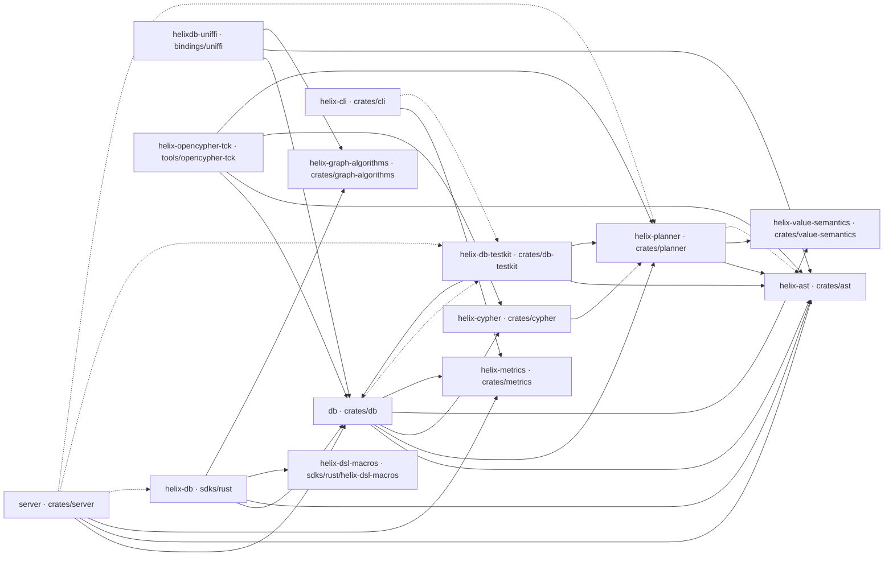
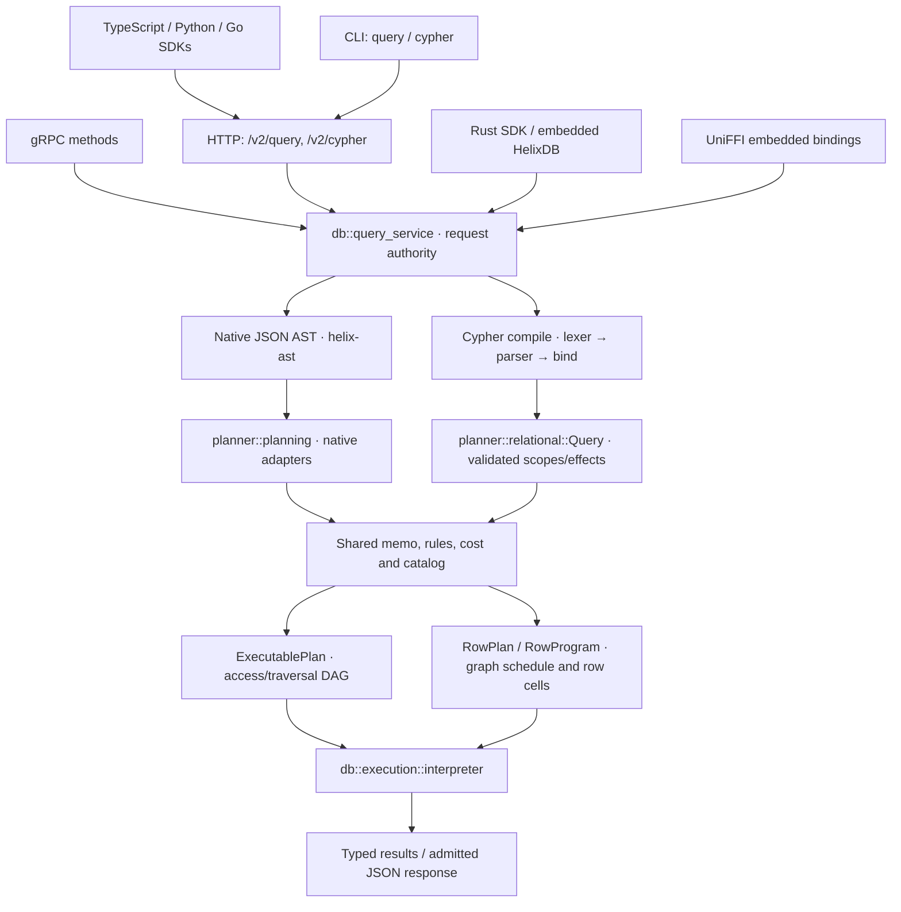
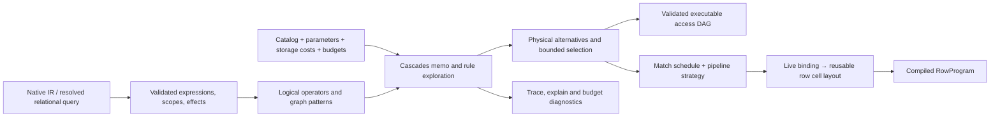
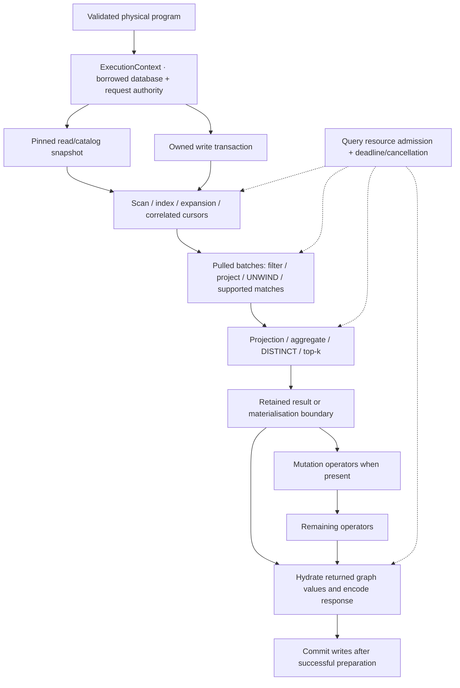
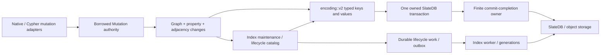

# Codebase map and correctness boundaries

This map describes the implementation in this checkout. Arrows in the package
graph mean **depends on**; arrows in the execution graphs mean **data or control
flows to**. Directory links are navigation points, not claims that every file in
that directory runs for every query. Rust package names and directory names
differ: `db` is the engine, `helix-db` is the Rust SDK, and `server` is the server.

## Workspace dependency graph

All workspace packages, including the automatically included Rust DSL macro
package, appear below. Solid edges are local normal dependencies; dashed edges
are local development dependencies. Optional dependencies are included. External
crates are omitted. This is a package graph, not a runtime call graph.



The `db`/`testkit` cycle exists only through a development dependency. The engine
does not depend on testkit in a normal production build. The CLI controls local
processes and speaks to services; it has no normal Rust dependency on the engine.
To verify package membership and edges locally:

```sh
cargo metadata --offline --locked --no-deps --format-version 1
```

## Public entrypoints and query flow



| Boundary | Main code | Contract |
| --- | --- | --- |
| Transports | [HTTP](../crates/server/src/http.rs), [gRPC](../crates/server/src/grpc.rs), [protobuf](../crates/server/proto) | Decode requests, routing, request limits and error mapping; delegate query semantics to the service. |
| Request service | [query_service.rs](../crates/db/src/query_service.rs), [cypher.rs](../crates/db/src/cypher.rs) | Tenant scope, execute/explain mode, parameters, catalog observation, cancellation and output format belong to one attempt. |
| Native language | [AST](../crates/ast/src), [native planning](../crates/planner/src/planning) | SDK JSON contracts and native semantics remain supported. |
| Cypher language | [frontend](../crates/cypher/src), [compiled requests](../crates/db/src/cypher/compiled.rs) | Resolve names to stable slots; reject unsupported semantics before execution; never translate through native DSL syntax. |
| Result encoding | [Cypher output](../crates/db/src/cypher/output.rs), [parameter decoding](../crates/db/src/cypher/parameters.rs) | Ordered columns, rectangular rows, lossless graph IDs and values; diagnostics stay outside result data. Prepare output before committing writes. |
| Native bindings | [UniFFI](../bindings/uniffi/src), [Rust SDK](../sdks/rust/src) | Own API/language conversion and runtime handles; delegate storage and query execution to the engine. |

Embedded entrypoints ultimately reach the same engine boundaries; the diagram
does not imply every SDK method constructs a `HelixQueryService` object.

## Planner: semantic validation before optimisation



| Planner subsystem | Responsibility and boundary |
| --- | --- |
| [context](../crates/planner/src/context.rs), [catalog](../crates/planner/src/catalog), [cost](../crates/planner/src/cost), [feedback](../crates/planner/src/feedback.rs) | Immutable planning inputs. The planner does not perform storage I/O. Estimates guide choices; they are not execution limits. |
| [ir](../crates/planner/src/ir), [analysis](../crates/planner/src/analysis), [logical](../crates/planner/src/logical) | Validated native operations, dependencies, access/traversal/control-flow contracts and logical properties. |
| [relational/query](../crates/planner/src/relational/query.rs), [contracts](../crates/planner/src/relational/contracts.rs), [schema](../crates/planner/src/relational/contracts/schema.rs) | Binding scope, references, correlation, nullability, multiplicity and effect boundaries. Deserialisation must rebuild derived proofs. |
| [expression](../crates/planner/src/relational/expression.rs), [evaluation](../crates/planner/src/relational/evaluation.rs), [value](../crates/planner/src/relational/value.rs), [value-semantics](../crates/value-semantics/src/lib.rs) | Scalar operations, numeric/grouping equality, three-valued logic and value bounds. Graph properties enter through `GraphValues`, not direct storage calls. |
| [selection](../crates/planner/src/relational/selection.rs), [projection](../crates/planner/src/relational/projection.rs) | Common validated programs with frontend adapters. Preserve simultaneous projection, duplicate rows and first evaluation failure. |
| [memo](../crates/planner/src/memo), [optimizer](../crates/planner/src/optimizer), [rules](../crates/planner/src/rules), [physical](../crates/planner/src/physical.rs), [properties](../crates/planner/src/properties.rs) | Explore equivalent plans, track required/delivered properties and select within finite budgets. |
| [planning](../crates/planner/src/planning), [exec](../crates/planner/src/exec) | Lower chosen native plans into validated executable DAGs. Access, search, mutations, windows, counts and control flow have specialised contracts. |
| [relational/planning](../crates/planner/src/relational/planning.rs), [graph_order](../crates/planner/src/relational/graph_order.rs) | Use shared access planning; choose pattern starts, expansion order, hash/index joins and Cartesian products. |
| [pipeline](../crates/planner/src/relational/pipeline.rs), [consumers](../crates/planner/src/relational/consumers.rs), [input_window](../crates/planner/src/relational/input_window.rs) | Prove which sources and consumers can batch, and separately which sources can terminate early. Streaming does not itself prove early termination. |
| [layout](../crates/planner/src/relational/layout.rs), [program](../crates/planner/src/relational/layout/program.rs) | Compact physical cells without changing logical slot identities or simultaneous live values. Account for retained program memory. |
| [diagnostics](../crates/planner/src/diagnostics), [trace](../crates/planner/src/trace), [digest](../crates/planner/src/digest.rs), [experiments](../crates/planner/src/experiments.rs) | Explainability, deterministic identities, plan-quality and scalability checks. |

There is shared optimiser and execution infrastructure, but there are still
distinct native traversal and relational row programs. The specialised traversal,
vector and text paths have different contracts. Treating all of them as already
one interchangeable operator interface would hide meaningful differences.

## Execution: pull batches, retained state and ownership



| Engine area | Navigation | Correctness rule |
| --- | --- | --- |
| Native DAG dispatch | [interpreter](../crates/db/src/execution/interpreter/mod.rs), [scheduler](../crates/db/src/execution/interpreter/scheduler.rs), [dispatch](../crates/db/src/execution/interpreter/dispatch.rs), [control](../crates/db/src/execution/interpreter/control) | Execute planned dependencies and effects; do not choose access paths again. |
| Native access/streams | [access](../crates/db/src/execution/interpreter/access), [stream](../crates/db/src/execution/interpreter/stream), [row_mode](../crates/db/src/execution/interpreter/row_mode.rs), [count](../crates/db/src/execution/interpreter/count.rs) | Specialised traversal state, count bounds, vector/text access and native semantic adapters. |
| Row program dispatch | [rows/mod](../crates/db/src/execution/interpreter/rows/mod.rs), [projection_chain](../crates/db/src/execution/interpreter/rows/projection_chain.rs) | Bounded producer/consumer pipelines where validated; materialised fallback elsewhere; mutations retain their order. |
| Graph matching | [matches](../crates/db/src/execution/interpreter/rows/matches.rs), [expansion_stack](../crates/db/src/execution/interpreter/rows/expansion_stack.rs), [bound_match](../crates/db/src/execution/interpreter/rows/bound_match.rs), [correlated](../crates/db/src/execution/interpreter/rows/correlated.rs) | Preserve repeated bindings, relationship uniqueness, direction, paths and optional null extension. Cursors resume without retaining a database handle. |
| Joining and access | [scan](../crates/db/src/execution/interpreter/rows/scan.rs), [lookup_cursor](../crates/db/src/execution/interpreter/rows/lookup_cursor.rs), [hash_probe](../crates/db/src/execution/interpreter/rows/hash_probe.rs), [cross_product](../crates/db/src/execution/interpreter/rows/cross_product.rs) | Batch physical access and preserve multiplicity. Hash build state and Cartesian output are not constant-memory by definition. |
| Property loading | [graph](../crates/db/src/execution/interpreter/rows/graph.rs), [requirements](../crates/db/src/execution/interpreter/rows/requirements.rs) | Carry graph IDs until required; batch unique property demands and admit temporary allocations. |
| Scalar row consumers | [projection](../crates/db/src/execution/interpreter/rows/projection.rs), [aggregation](../crates/db/src/execution/interpreter/rows/aggregation.rs), [distinct](../crates/db/src/execution/interpreter/rows/distinct.rs), [top_k](../crates/db/src/execution/interpreter/rows/top_k.rs) | Keep equality, null ordering, empty aggregation and late errors consistent across batching strategies. |
| Windows | [Window](../crates/planner/src/relational/window.rs), [InputWindow](../crates/planner/src/relational/input_window.rs) | `Window` validates runtime offsets. `InputWindow` proves source termination. A retained-state bound is not permission to stop reading. |
| Resource ownership | [query_resources](../crates/db/src/query_resources.rs), [row memory](../crates/db/src/execution/interpreter/rows/memory.rs), [execution_control](../crates/db/src/execution_control.rs) | Admission follows live owners; cancellation and deadline checks bound execution. The memory estimate is not an RSS cap. |
| Snapshot reads | [read_view](../crates/db/src/execution/interpreter/read_view.rs), [storage](../crates/db/src/execution/interpreter/storage.rs), [read_cache](../crates/db/src/execution/interpreter/storage/read_cache.rs) | Reuse raw values only inside the same eligible pinned read scope. Optional cache entries are bounded and reclaimable; writes bypass reuse. |

Materialisation depends on the selected pipeline:

| Operation | Retained state | May consume all input? |
| --- | --- | --- |
| Eligible pure `MATCH`/`UNWIND` followed by a proven window | Batches, cursor state and requested output | Can stop early after sufficient validated matches. |
| General filtering or correlated pipeline | Batches plus continuation state | Yes; current source-stop proof does not cross these boundaries. |
| Plain projection | Batches and retained output | Yes, especially if later expressions can fail. |
| Nonaggregate `DISTINCT` without ordering | At most `SKIP + LIMIT` ordered equality classes when limited; all unique classes otherwise | Yes. Preserves the same deterministic subset and late errors as materialised execution. |
| Eligible `ORDER BY` with limit | Top `SKIP + LIMIT` rows and sort keys | Yes. A top-k heap bounds memory, not storage reads. |
| Full sorting | All sortable rows and keys | Yes. |
| Grouping | Group keys and accumulator state; `collect` retains values | Yes. |
| Mutations and unsupported fused boundaries | Required input/result materialisation and write state | Yes; do not let writes change their own input scan. |
| Response | Returned values and encoded buffer | Yes; public responses are buffered, not client streams. |

Disk spilling is not implemented. Resource exhaustion must fail the query, never
silently truncate its successful result. The complete public behaviour is in the
[Cypher reference](cypher.md).

## Storage, transactions and indexes



| Subsystem | Ownership |
| --- | --- |
| [HelixDB](../crates/db/src/lib.rs), [config](../crates/db/src/config), [runtime_dependencies](../crates/db/src/runtime_dependencies.rs) | Database lifecycle, backend handles, validated configuration, runtime readiness and request catalog views. |
| [transaction](../crates/db/src/transaction.rs), [commit_completion](../crates/db/src/commit_completion.rs) | The transaction owner alone commits. Borrowed mutation helpers cannot commit or extract it. Read/merge ledgers live through backend completion. |
| [native mutations](../crates/db/src/execution/interpreter/mutation), [row mutations](../crates/db/src/execution/interpreter/rows/mutations.rs) | Frontend-specific semantics over existing typed graph mutation APIs. Plain node deletion checks attached relationships; detach deletion is explicit. |
| [encoding/v2](../crates/db/src/encoding/v2) | Authoritative keys and values. `encoding::keys`, `encoding::values` and property aliases re-export v2. New code must not build raw persistence bytes independently. |
| [encoding/v1](../crates/db/src/encoding/v1), [migrations](../crates/db/src/migrations), [migration_parity](../crates/db/src/migration_parity.rs) | Compatibility/migration code, not a second layout for Cypher. |
| [index_lifecycle](../crates/db/src/index_lifecycle) | Validated catalog records, generations, DDL, mutation catalog, scope gates, repository, outbox and bounded work. |
| [search](../crates/db/src/search), [text](../crates/db/src/search/text), [vector](../crates/db/src/search/vector) | Secondary lookup, text and vector algorithms backed by typed codecs and lifecycle state. |
| [id_allocator](../crates/db/src/id_allocator.rs), [merge_operator](../crates/db/src/merge_operator.rs) | Identity allocation and backend merge interpretation; preserve existing persistence semantics. |

Cypher support and the bounded-window change do not introduce a storage-format
migration. A transaction may commit after the caller stops waiting once commit
completion has taken ownership; cancellation is not a promise to undo an already
submitted commit. Tests must distinguish pre-commit rollback from that boundary.

## Remaining repository surfaces

| Area | Main contents and role |
| --- | --- |
| [Rust SDK](../sdks/rust), [DSL macros](../sdks/rust/helix-dsl-macros) | Request builders, HTTP/embedded APIs, graph loading, lifecycle APIs and compile-time DSL helpers. The [standalone SDK example](../sdks/rust/example) has its own workspace and is outside the main workspace test command. |
| [TypeScript SDK](../sdks/typescript), [Python SDK](../sdks/python), [Go SDK](../sdks/go) | Public language APIs, native-loading glue where supported, request/result conversion and graph APIs. |
| [UniFFI](../bindings/uniffi), [bindgen tools](../bindings/uniffi-bindgen) | Embedded native bridge and separately built generators. Generated artifacts are not core query logic. |
| [Graph algorithms](../crates/graph-algorithms/src) | Validated immutable graph model, identities, loading, transformations and local algorithms. No database/planner dependency. |
| [CLI](../crates/cli/src) | Commands, project/config paths, local runtime installation, host actions, cloud requests, auth, shell/query/Cypher, updates and output. |
| [Metrics](../crates/metrics/src) | Query/transport and CLI telemetry. Separate from graph data, planner semantics and result columns. |
| [DB testkit](../crates/db-testkit/src) | Independent model, action histories, fixtures, replay/shrinking, planner domain and lifecycle/concurrency workloads. |
| [openCypher TCK](../tools/opencypher-tck) | Pinned corpus, scenario expansion, production execution, independent value/graph/side-effect comparison, worker isolation, reports and regression manifests. |
| [Migration parity tool](../tools/hyperscale-migration-parity) | Separate workspace; independent migration oracles and external sorting. Requires an external source checkout, so it is not covered by the main workspace command. |
| [Fuzz targets](../crates/db/fuzz), [testkit fuzz targets](../crates/db-testkit/fuzz) | Separate cargo-fuzz workspaces for malformed values, planners and operation sequences; not automatically run by ordinary workspace tests. |
| [Scripts](../scripts) | Coverage thresholds, corpus/normalisation gates, migration and scale runners. |
| [Container packaging](../docker-image), [Dockerfile](../Dockerfile) | Runtime image, release packaging and Docker/Compose smoke tests. |
| [Documentation](../docs), [assets](../assets) | Reference docs, examples, docs site and branding. |
| [.github workflows](../.github/workflows) | CI/release definitions. Local verification does not require dispatching remote workflows. |

## Correctness and verification map

| Gate | What it establishes |
| --- | --- |
| `cargo test --locked --workspace --all-targets` | Default-feature unit, integration and target checks across workspace packages; ignored and feature-gated tests are separate. |
| `cargo test --locked --workspace --doc` | Executable contract examples. |
| [Planner tests](../crates/planner/tests) and [planner corpus script](../scripts/planner-normalized-corpus.sh) | Validation, rewrite legality, deterministic fallback, costs, operator contracts and plan-quality regressions. |
| [Row executor tests](../crates/db/src/execution/interpreter/rows/tests) | Batches versus materialised/reference execution, independent expected rows, errors, scopes, admission and rollback. |
| [Production contracts](../crates/db/tests/production_internal_contracts.rs) with `production-coverage` | Production-linked storage/interpreter behaviour beyond `cfg(test)` paths. |
| `cargo run --locked -p helix-opencypher-tck -- --gate --output target/cypher-tck.json` | Whole pinned corpus accounting, required scenarios, individual previous-pass regressions, errors, graph effects and harness health. Exclusions remain visible. |
| `npm --prefix sdks/typescript run test:parity` | Cross-language request fixtures and embedded/server execution, including disk restart behaviour. Requires local test servers. |
| [Cypher coverage](../scripts/cypher-coverage.sh), [workspace coverage](../scripts/workspace-coverage.sh), specialised coverage scripts | Explicit denominators and minimum coverage. Passing functional tests alone does not establish a coverage threshold. |
| [Cypher scaling](../crates/db/examples/cypher_scaling.rs), [DB benches](../crates/db/benches), [planner benches](../crates/planner/benches) | Independent expected results, bounded planner work, actual read counts and admitted-memory guards; latency measured separately. |
| `cargo fmt --all -- --check` and `cargo clippy --workspace -- -D warnings` | Formatting and code-quality gates with the pinned stable toolchain. |

## Simplification decisions and remaining work

The window consumers now use one evaluated `Window` contract for offset
validation and retention bounds. This removes repeated evaluation code from
plain projection, pipeline projection, DISTINCT and top-k. `InputWindow` remains
separate: it proves legal early termination, which is a different responsibility.
Its consecutive-projection proof composes literal window bounds and permits any
validated window in the prefix to stop the source. Dynamic downstream windows
stop through consumer counters without moving their validation ahead of source
setup. Earlier exhausted windows still stop even when a later skip produces no
rows; downstream expansion continuations finish before stopping upstream input.

The [formatter configuration](../rustfmt.toml) records only the workspace parsing
edition and its existing style edition. Other settings come from the pinned
stable toolchain, avoiding a copied defaults dump containing unsupported nightly
options. Effective stable settings and formatted source remain unchanged.

Limited DISTINCT keeps a bounded ordered set while preserving the same first
representative of each retained equality class. Its cutoff only decreases; an
evicted class can never enter the final smallest set later. This keeps the
materialised strategy useful as a correctness oracle instead of changing both
paths to the same algorithm.

Further simplification should follow these boundaries:

1. Extend source-stop proofs only with explicit expression/effect guarantees.
   A filter needs demand measured after filtering; passing a raw row limit into
   its source can produce too few results. Late errors and optional boundaries
   need tests before widening any proof.
2. Keep reference execution independent. It intentionally uses more memory;
   removing it as duplication would weaken differential tests.
3. Consolidate consumer classification/dispatch only when aggregate, ordering,
   predicate and mutation stages have the same contracts. Their similar match
   arms currently encode different completion behaviour.
4. Keep storage codecs, index lifecycle and transaction authority central.
   Do not simplify by bypassing typed keys, catalog checks or write ledgers.
5. Review small planner modules by dependency and invariant, not file count.
   Many separate selected-plan contracts exist to reject invalid combinations;
   flattening them without preserving that boundary is not a correctness gain.
6. Add disk spilling and client streaming as explicit protocols if needed.
   Neither follows automatically from batch execution, and both affect
   cancellation, resource ownership and transaction completion.

This is a navigation and contract map, not a claim that every path has been
formally verified. Local test and benchmark reports should record the exact
checks performed without replacing the independent oracles or accepting new
baselines automatically.
