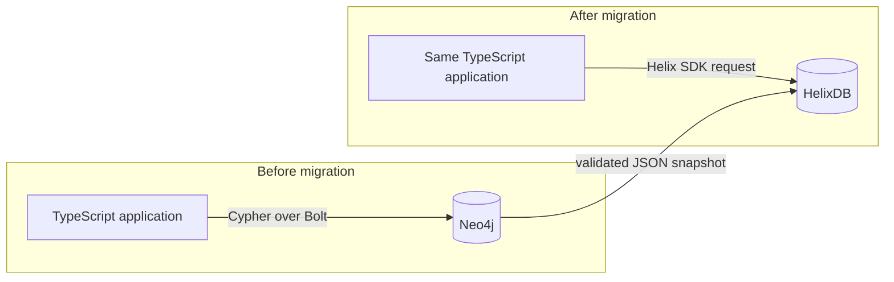
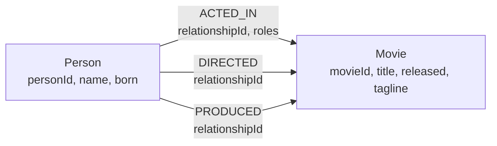
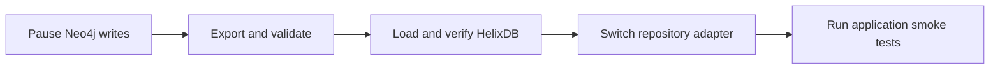

<div className="flex flex-wrap gap-2"><Badge color="orange" size="sm">Tutorial</Badge></div>

This tutorial moves a working Neo4j Movie Graph application to HelixDB. You will
export a checked JSON snapshot, load it with replay-safe batches, translate two
Cypher queries, and prove that both repository implementations return the same
application objects.

<CardGroup cols={3}>
  <Card title="Source" icon="circle-nodes">
    Neo4j 5 with `Person`, `Movie`, and three relationship types.
  </Card>
  <Card title="Migration" icon="arrow-right-arrow-left">
    A maintenance-window JSON snapshot loaded with the TypeScript SDK.
  </Card>
  <Card title="Result" icon="check">
    The same `MovieRepository` contract backed by HelixDB.
  </Card>
</CardGroup>

## Before you start

You need Node.js 20 or newer, Docker with Compose, and a maintenance window in
which application writes can be paused. The companion project is in
`docs/examples/neo4j-migration` in the HelixDB repository.

```bash
cd docs/examples/neo4j-migration
npm ci
docker compose up -d
npm run seed
```

The containers expose Neo4j Bolt on `localhost:17687` and HelixDB on
`localhost:16969`. Change the connection values with the variables in
`.env.example` when you use your own databases.



## Migration walkthrough

<Steps>
  <Step title="1. Review the Neo4j project">

The example is a small movie service. People act in, direct, or produce movies;
every relationship points from a `Person` to a `Movie`.



The source schema uses stable application IDs rather than Neo4j's internal node
or relationship IDs:

```cypher
CREATE CONSTRAINT person_id IF NOT EXISTS
FOR (person:Person) REQUIRE person.personId IS UNIQUE;

CREATE CONSTRAINT movie_id IF NOT EXISTS
FOR (movie:Movie) REQUIRE movie.movieId IS UNIQUE;
```

| Source element | Identity used during migration | Direction          |
| -------------- | ------------------------------ | ------------------ |
| `Person`       | `personId`                     | —                  |
| `Movie`        | `movieId`                      | —                  |
| `ACTED_IN`     | `relationshipId`               | `Person` → `Movie` |
| `DIRECTED`     | `relationshipId`               | `Person` → `Movie` |
| `PRODUCED`     | `relationshipId`               | `Person` → `Movie` |

The application exposes two reads through one interface:

{/* single-sdk-examples: TypeScript */}

<CodeGroup>

```ts TypeScript
interface MovieRepository {
  movieDetails(movieId: string): Promise<MovieDetails | null>;
  personFilmography(personId: string): Promise<PersonFilmography | null>;
}
```

</CodeGroup>

This contract is the acceptance boundary. The migration is complete only when
the Neo4j and HelixDB implementations return equal objects.

  </Step>

  <Step title="2. Map the graph to HelixDB">

The sample maps directly because every source node has one label and every
relationship already has an explicit direction and stable ID.

| Neo4j                 | HelixDB               | Migration decision                                       |
| --------------------- | --------------------- | -------------------------------------------------------- |
| Node label            | Node label            | Keep `Person` and `Movie` exactly, including case.       |
| Relationship type     | Edge label            | Keep `ACTED_IN`, `DIRECTED`, and `PRODUCED`.             |
| Node property         | Node property         | Keep the existing property names and types.              |
| Relationship property | Edge property         | Keep `relationshipId` and `roles`.                       |
| Unique constraint     | Unique equality index | Create indexes on `Person.personId` and `Movie.movieId`. |
| Relationship lookup   | Equality index        | Index `relationshipId` on each edge label.               |

<Warning>
  Neo4j nodes can have several labels. A HelixDB node has one label. If your
  source uses combinations such as `:Person:Actor`, choose one HelixDB label and
  preserve the other classifications as properties or explicit edges before
  exporting.
</Warning>

Do not migrate Neo4j internal IDs. They can change after a restore. Use stable
business IDs for nodes and add a stable logical ID to every relationship.

  </Step>

  <Step title="3. Pause writes and export JSON">

Pause every writer to Neo4j before the export begins. The example exporter opens
one read transaction, runs label-specific Cypher queries, sorts every record by
its stable ID, and writes a SHA-256 sidecar.

```bash
MIGRATION_EXPORTED_AT=2026-08-11T00:00:00.000Z \
  npm run export -- movie-graph.v1.json
```

The timestamp override is useful for repeatable tests. Omit it for a real export.

The dump is versioned and discriminated by `kind`, so unsupported or ambiguous
records cannot silently enter the loader:

```json
{
  "version": 1,
  "exportedAt": "2026-08-11T00:00:00.000Z",
  "nodes": [
    {
      "kind": "person",
      "personId": "p-keanu",
      "name": "Keanu Reeves",
      "born": 1964
    },
    {
      "kind": "movie",
      "movieId": "m-matrix",
      "title": "The Matrix",
      "released": 1999,
      "tagline": "Welcome to the Real World"
    }
  ],
  "relationships": [
    {
      "kind": "acted_in",
      "relationshipId": "r-acted-keanu-matrix",
      "fromPersonId": "p-keanu",
      "toMovieId": "m-matrix",
      "roles": ["Neo"]
    }
  ]
}
```

{/* single-sdk-examples: TypeScript */}

<CodeGroup>

```ts TypeScript
const dump = await exportNeo4jSnapshot(
  driver,
  config.neo4jDatabase,
  new Date().toISOString(),
);

const digest = await writeDump("movie-graph.v1.json", dump);
console.log(`SHA-256: ${digest}`);
```

</CodeGroup>

<Warning>
  A Neo4j native `.dump` is a Neo4j backup format. HelixDB cannot load it
  directly. Export a logical format such as this JSON document, transform it
  explicitly, and write it through a HelixDB SDK. See Neo4j's [dump and restore
  documentation](https://neo4j.com/docs/operations-manual/current/backup-restore/restore-dump/)
  for the purpose of native dumps.
</Warning>

  </Step>

  <Step title="4. Validate before writing">

Run validation while Neo4j writes remain paused:

```bash
npm run validate -- movie-graph.v1.json
```

The validator checks the checksum, dump version, exact property types, unique
node and relationship IDs, non-empty roles, and both endpoints of every
relationship. It finishes before the loader sends its first HelixDB write.

<Accordion title="Example validation failures">

- `duplicate Person.personId: p-keanu`
- `r-acted-keanu-matrix references missing Movie m-matrix`
- `checksum mismatch for movie-graph.v1.json`
- an unknown `version` or `kind`

</Accordion>

Keep the JSON file and its `.sha256` file together. If validation fails, repair
the source mapping or exporter and create a new snapshot; do not partially edit
the dump.

  </Step>

  <Step title="5. Create indexes and wait for them">

Before importing data, create unique equality indexes for `Person.personId` and
`Movie.movieId`, plus an equality index for `relationshipId` on each edge label.
The loader submits all five definitions with `createIndexIfNotExists`.

Index creation is asynchronous. The loader parses every returned operation ID,
polls `getIndexOperation`, and continues only after every status is `succeeded`.
It stops on `blocked`, `aborted`, or timeout. Never start the node batches merely
because the index request was accepted.

  </Step>

  <Step title="6. Load nodes, then relationships">

Load the validated snapshot:

```bash
npm run load -- movie-graph.v1.json
```

The loader performs these operations in order:

1. Confirm that all five indexes are active.
2. Upsert `Person` and `Movie` nodes in bounded batches.
3. Replace each relationship by its stable `relationshipId`.
4. Await write durability and retry the complete batch after an HTTP `409` conflict.

{/* single-sdk-examples: TypeScript */}

<CodeGroup>

```ts TypeScript
const body = writeBatch()
  .varAs(
    "existing",
    g().nWithLabel("Person").where(Predicate.eqParam("personId", "personId")),
  )
  .varAsIf(
    "updated",
    BatchCondition.varNotEmpty("existing"),
    g()
      .n(NodeRef.var("existing"))
      .setProperty("name", PropertyInput.param("name"))
      .setProperty("born", PropertyInput.param("born")),
  )
  .varAsIf(
    "created",
    BatchCondition.varEmpty("existing"),
    g().addN("Person", {
      personId: PropertyInput.param("personId"),
      name: PropertyInput.param("name"),
      born: PropertyInput.param("born"),
    }),
  );

const request = writeBatch()
  .forEachParam("rows", body)
  .returning(["updated", "created"])
  .toQueryRequest(rowsParams, { rows }, { queryName: "upsert_people" });
```

</CodeGroup>

One HelixDB request is one transaction. If a request fails, none of that batch is
committed. Replaying the same dump updates existing nodes and replaces existing
edges with `dropEdgeById`, so an interrupted single-process load can continue:

```bash
npm run load -- movie-graph.v1.json --stop-after-nodes
npm run load -- movie-graph.v1.json
```

<Warning>
  Use one loader process and a fresh HelixDB target for this procedure. Edge
  equality indexes are not uniqueness constraints, so concurrent loader
  processes can race even though sequential replay is safe.
</Warning>

  </Step>

  <Step title="7. Replace the Cypher repository">

Translate behavior, not tokens. For each Cypher query, identify its indexed
anchor, edge direction, required edge properties, output fields, and ordering.
Keep the application-facing `MovieRepository` contract unchanged; only replace
its database adapter.

### Movie details

The Neo4j query anchors a movie and uses incoming relationships because every
source relationship points from a person to the movie:

```cypher
MATCH (movie:Movie {movieId: $movieId})
RETURN movie{.movieId, .title, .released, .tagline} AS movie,
       [(person:Person)-[credit:ACTED_IN]->(movie) |
         person{.personId, .name, .born, roles: credit.roles}] AS cast,
       [(person:Person)-[:DIRECTED]->(movie) |
         person{.personId, .name, .born}] AS directors,
       [(person:Person)-[:PRODUCED]->(movie) |
         person{.personId, .name, .born}] AS producers
```

The HelixDB form keeps the movie as a named transaction-local result, traverses
`inE`, and projects person fields from each edge's `$from` endpoint.

<CodeGroup>

```rust Rust
fn movie_details(movie_id: &str) -> QueryRequest {
    QueryRequest::read(
        read_batch()
            .var_as(
                "movie_node",
                g().n_with_label("Movie")
                    .where_(Predicate::eq_param("movieId", "movie_id")),
            )
            .var_as(
                "movie",
                g().n(NodeRef::var("movie_node")).project(vec![
                    Projection::property("movieId", "movieId"),
                    Projection::property("title", "title"),
                    Projection::property("released", "released"),
                    Projection::property("tagline", "tagline"),
                ]),
            )
            .var_as(
                "cast",
                g().n(NodeRef::var("movie_node"))
                    .in_e(Some("ACTED_IN"))
                    .project(vec![
                        Projection::from_endpoint("personId", "personId"),
                        Projection::from_endpoint("name", "name"),
                        Projection::from_endpoint("born", "born"),
                        Projection::property("roles", "roles"),
                    ]),
            )
            .var_as(
                "directors",
                g().n(NodeRef::var("movie_node"))
                    .in_e(Some("DIRECTED"))
                    .project(vec![
                        Projection::from_endpoint("personId", "personId"),
                        Projection::from_endpoint("name", "name"),
                        Projection::from_endpoint("born", "born"),
                    ]),
            )
            .var_as(
                "producers",
                g().n(NodeRef::var("movie_node"))
                    .in_e(Some("PRODUCED"))
                    .project(vec![
                        Projection::from_endpoint("personId", "personId"),
                        Projection::from_endpoint("name", "name"),
                        Projection::from_endpoint("born", "born"),
                    ]),
            )
            .returning(["movie", "cast", "directors", "producers"]),
    )
    .with_query_name("movie_details")
    .with_typed_parameter(
        "movie_id",
        QueryParamType::String,
        QueryValue::String(movie_id.to_string()),
    )
    .expect("movie_id is valid")
}
```

```ts TypeScript
const params = defineParams({ movie_id: param.string() });

function movieDetails(movieId: string) {
  return readBatch()
    .varAs(
      "movie_node",
      g().nWithLabel("Movie").where(Predicate.eqParam("movieId", "movie_id")),
    )
    .varAs(
      "movie",
      g()
        .n(NodeRef.var("movie_node"))
        .project([
          Projection.property("movieId", "movieId"),
          Projection.property("title", "title"),
          Projection.property("released", "released"),
          Projection.property("tagline", "tagline"),
        ]),
    )
    .varAs(
      "cast",
      g()
        .n(NodeRef.var("movie_node"))
        .inE("ACTED_IN")
        .project([
          Projection.fromEndpoint("personId", "personId"),
          Projection.fromEndpoint("name", "name"),
          Projection.fromEndpoint("born", "born"),
          Projection.property("roles", "roles"),
        ]),
    )
    .varAs(
      "directors",
      g()
        .n(NodeRef.var("movie_node"))
        .inE("DIRECTED")
        .project([
          Projection.fromEndpoint("personId", "personId"),
          Projection.fromEndpoint("name", "name"),
          Projection.fromEndpoint("born", "born"),
        ]),
    )
    .varAs(
      "producers",
      g()
        .n(NodeRef.var("movie_node"))
        .inE("PRODUCED")
        .project([
          Projection.fromEndpoint("personId", "personId"),
          Projection.fromEndpoint("name", "name"),
          Projection.fromEndpoint("born", "born"),
        ]),
    )
    .returning(["movie", "cast", "directors", "producers"])
    .toQueryRequest(
      params,
      { movie_id: movieId },
      { queryName: "movie_details" },
    );
}
```

```go Go
func MovieDetails(movieID string) helix.Request {
	q := helix.ReadQuery("movie_details")
	id := q.ParamString("movie_id", movieID)
	return q.
		VarAs("movie_node", helix.G().NWithLabel("Movie").Where(helix.PredEq("movieId", id))).
		VarAs("movie", helix.G().N(helix.NodeVar("movie_node")).Project(
			helix.ProjectPropAs("movieId", "movieId"),
			helix.ProjectPropAs("title", "title"),
			helix.ProjectPropAs("released", "released"),
			helix.ProjectPropAs("tagline", "tagline"),
		)).
		VarAs("cast", helix.G().N(helix.NodeVar("movie_node")).InE("ACTED_IN").Project(
			helix.ProjectFromEndpoint("personId", "personId"),
			helix.ProjectFromEndpoint("name", "name"),
			helix.ProjectFromEndpoint("born", "born"),
			helix.ProjectPropAs("roles", "roles"),
		)).
		VarAs("directors", helix.G().N(helix.NodeVar("movie_node")).InE("DIRECTED").Project(
			helix.ProjectFromEndpoint("personId", "personId"),
			helix.ProjectFromEndpoint("name", "name"),
			helix.ProjectFromEndpoint("born", "born"),
		)).
		VarAs("producers", helix.G().N(helix.NodeVar("movie_node")).InE("PRODUCED").Project(
			helix.ProjectFromEndpoint("personId", "personId"),
			helix.ProjectFromEndpoint("name", "name"),
			helix.ProjectFromEndpoint("born", "born"),
		)).
		Returning("movie", "cast", "directors", "producers")
}
```

```python Python
movie_details_params = define_params({"movie_id": param.string()})

def movie_details(movie_id: str):
    query = (
        read_batch()
        .var_as(
            "movie_node",
            g().n_with_label("Movie").where(
                Predicate.eq_param("movieId", "movie_id")
            ),
        )
        .var_as("movie", g().n(NodeRef.var("movie_node")).project([
            Projection.property("movieId", "movieId"),
            Projection.property("title", "title"),
            Projection.property("released", "released"),
            Projection.property("tagline", "tagline"),
        ]))
        .var_as("cast", g().n(NodeRef.var("movie_node")).in_e("ACTED_IN").project([
            Projection.from_endpoint("personId", "personId"),
            Projection.from_endpoint("name", "name"),
            Projection.from_endpoint("born", "born"),
            Projection.property("roles", "roles"),
        ]))
        .var_as("directors", g().n(NodeRef.var("movie_node")).in_e("DIRECTED").project([
            Projection.from_endpoint("personId", "personId"),
            Projection.from_endpoint("name", "name"),
            Projection.from_endpoint("born", "born"),
        ]))
        .var_as("producers", g().n(NodeRef.var("movie_node")).in_e("PRODUCED").project([
            Projection.from_endpoint("personId", "personId"),
            Projection.from_endpoint("name", "name"),
            Projection.from_endpoint("born", "born"),
        ]))
        .returning(["movie", "cast", "directors", "producers"])
    )
    return query.to_query_request(
        movie_details_params,
        {"movie_id": movie_id},
        query_name="movie_details",
    )
```

```json JSON
{
  "request_type": "read",
  "query_name": "movie_details",
  "query": {
    "read": {
      "entries": [
        {
          "query": {
            "name": "movie_node",
            "root": {
              "where": {
                "input": {
                  "nodes_where": {
                    "predicate": {
                      "eq": {
                        "left": { "property": "$label" },
                        "right": { "constant": { "string": "Movie" } }
                      }
                    }
                  }
                },
                "predicate": {
                  "eq": {
                    "left": { "property": "movieId" },
                    "right": { "param": "movie_id" }
                  }
                }
              }
            }
          }
        },
        {
          "query": {
            "name": "movie",
            "root": {
              "project": {
                "input": { "nodes": { "reference": { "var": "movie_node" } } },
                "projections": [
                  { "property": { "source": "movieId", "alias": "movieId" } },
                  { "property": { "source": "title", "alias": "title" } },
                  { "property": { "source": "released", "alias": "released" } },
                  { "property": { "source": "tagline", "alias": "tagline" } }
                ]
              }
            }
          }
        },
        {
          "query": {
            "name": "cast",
            "root": {
              "project": {
                "input": {
                  "in_e": {
                    "input": {
                      "nodes": { "reference": { "var": "movie_node" } }
                    },
                    "label": "ACTED_IN"
                  }
                },
                "projections": [
                  {
                    "property": {
                      "source": "$from.personId",
                      "alias": "personId"
                    }
                  },
                  { "property": { "source": "$from.name", "alias": "name" } },
                  { "property": { "source": "$from.born", "alias": "born" } },
                  { "property": { "source": "roles", "alias": "roles" } }
                ]
              }
            }
          }
        },
        {
          "query": {
            "name": "directors",
            "root": {
              "project": {
                "input": {
                  "in_e": {
                    "input": {
                      "nodes": { "reference": { "var": "movie_node" } }
                    },
                    "label": "DIRECTED"
                  }
                },
                "projections": [
                  {
                    "property": {
                      "source": "$from.personId",
                      "alias": "personId"
                    }
                  },
                  { "property": { "source": "$from.name", "alias": "name" } },
                  { "property": { "source": "$from.born", "alias": "born" } }
                ]
              }
            }
          }
        },
        {
          "query": {
            "name": "producers",
            "root": {
              "project": {
                "input": {
                  "in_e": {
                    "input": {
                      "nodes": { "reference": { "var": "movie_node" } }
                    },
                    "label": "PRODUCED"
                  }
                },
                "projections": [
                  {
                    "property": {
                      "source": "$from.personId",
                      "alias": "personId"
                    }
                  },
                  { "property": { "source": "$from.name", "alias": "name" } },
                  { "property": { "source": "$from.born", "alias": "born" } }
                ]
              }
            }
          }
        }
      ],
      "returns": ["movie", "cast", "directors", "producers"]
    }
  },
  "parameters": { "movie_id": "m-matrix" },
  "parameter_types": { "movie_id": "string" }
}
```

</CodeGroup>

### Person filmography

The Cypher query keeps the `ACTED_IN.roles` edge value alongside each movie and
orders the collected movies:

```cypher
MATCH (person:Person {personId: $personId})
OPTIONAL MATCH (person)-[credit:ACTED_IN]->(movie:Movie)
WITH person, credit, movie
ORDER BY movie.released DESC, movie.title ASC
RETURN person{.personId, .name, .born} AS person,
       collect(CASE WHEN movie IS NULL THEN null
         ELSE movie{.movieId, .title, .released, .tagline, roles: credit.roles}
       END) AS movies
```

The HelixDB query binds the edge as `credit` and the target node as `movie`, then
projects fields from both into each result row.

<CodeGroup>

```rust Rust
fn person_filmography(person_id: &str) -> QueryRequest {
    QueryRequest::read(
        read_batch()
            .var_as(
                "person_node",
                g().n_with_label("Person")
                    .where_(Predicate::eq_param("personId", "person_id")),
            )
            .var_as(
                "person",
                g().n(NodeRef::var("person_node")).project(vec![
                    Projection::property("personId", "personId"),
                    Projection::property("name", "name"),
                    Projection::property("born", "born"),
                ]),
            )
            .var_as(
                "movies",
                g().n(NodeRef::var("person_node"))
                    .out_e(Some("ACTED_IN"))
                    .bind("credit")
                    .out_n()
                    .bind("movie")
                    .project_bindings(vec![
                        BindingProjection::binding("movie", "movieId", "movieId"),
                        BindingProjection::binding("movie", "title", "title"),
                        BindingProjection::binding("movie", "released", "released"),
                        BindingProjection::binding("movie", "tagline", "tagline"),
                        BindingProjection::binding("credit", "roles", "roles"),
                    ]),
            )
            .returning(["person", "movies"]),
    )
    .with_query_name("person_filmography")
    .with_typed_parameter(
        "person_id",
        QueryParamType::String,
        QueryValue::String(person_id.to_string()),
    )
    .expect("person_id is valid")
}
```

```ts TypeScript
const params = defineParams({ person_id: param.string() });

function personFilmography(personId: string) {
  return readBatch()
    .varAs(
      "person_node",
      g()
        .nWithLabel("Person")
        .where(Predicate.eqParam("personId", "person_id")),
    )
    .varAs(
      "person",
      g()
        .n(NodeRef.var("person_node"))
        .project([
          Projection.property("personId", "personId"),
          Projection.property("name", "name"),
          Projection.property("born", "born"),
        ]),
    )
    .varAs(
      "movies",
      g()
        .n(NodeRef.var("person_node"))
        .outE("ACTED_IN")
        .bind("credit")
        .outN()
        .bind("movie")
        .projectBindings([
          BindingProjection.binding("movie", "movieId", "movieId"),
          BindingProjection.binding("movie", "title", "title"),
          BindingProjection.binding("movie", "released", "released"),
          BindingProjection.binding("movie", "tagline", "tagline"),
          BindingProjection.binding("credit", "roles", "roles"),
        ]),
    )
    .returning(["person", "movies"])
    .toQueryRequest(
      params,
      { person_id: personId },
      {
        queryName: "person_filmography",
      },
    );
}
```

```go Go
func PersonFilmography(personID string) helix.Request {
	q := helix.ReadQuery("person_filmography")
	id := q.ParamString("person_id", personID)
	return q.
		VarAs("person_node", helix.G().NWithLabel("Person").Where(helix.PredEq("personId", id))).
		VarAs("person", helix.G().N(helix.NodeVar("person_node")).Project(
			helix.ProjectPropAs("personId", "personId"),
			helix.ProjectPropAs("name", "name"),
			helix.ProjectPropAs("born", "born"),
		)).
		VarAs("movies", helix.G().N(helix.NodeVar("person_node")).
			OutE("ACTED_IN").Bind("credit").OutN().Bind("movie").ProjectBindings(
				helix.ProjectNamedBinding("movie", "movieId", "movieId"),
				helix.ProjectNamedBinding("movie", "title", "title"),
				helix.ProjectNamedBinding("movie", "released", "released"),
				helix.ProjectNamedBinding("movie", "tagline", "tagline"),
				helix.ProjectNamedBinding("credit", "roles", "roles"),
			)).
		Returning("person", "movies")
}
```

```python Python
filmography_params = define_params({"person_id": param.string()})

def person_filmography(person_id: str):
    query = (
        read_batch()
        .var_as(
            "person_node",
            g().n_with_label("Person").where(
                Predicate.eq_param("personId", "person_id")
            ),
        )
        .var_as("person", g().n(NodeRef.var("person_node")).project([
            Projection.property("personId", "personId"),
            Projection.property("name", "name"),
            Projection.property("born", "born"),
        ]))
        .var_as(
            "movies",
            g().n(NodeRef.var("person_node"))
            .out_e("ACTED_IN")
            .bind("credit")
            .out_n()
            .bind("movie")
            .project_bindings([
                BindingProjection.binding("movie", "movieId", "movieId"),
                BindingProjection.binding("movie", "title", "title"),
                BindingProjection.binding("movie", "released", "released"),
                BindingProjection.binding("movie", "tagline", "tagline"),
                BindingProjection.binding("credit", "roles", "roles"),
            ]),
        )
        .returning(["person", "movies"])
    )
    return query.to_query_request(
        filmography_params,
        {"person_id": person_id},
        query_name="person_filmography",
    )
```

```json JSON
{
  "request_type": "read",
  "query_name": "person_filmography",
  "query": {
    "read": {
      "entries": [
        {
          "query": {
            "name": "person_node",
            "root": {
              "where": {
                "input": {
                  "nodes_where": {
                    "predicate": {
                      "eq": {
                        "left": { "property": "$label" },
                        "right": { "constant": { "string": "Person" } }
                      }
                    }
                  }
                },
                "predicate": {
                  "eq": {
                    "left": { "property": "personId" },
                    "right": { "param": "person_id" }
                  }
                }
              }
            }
          }
        },
        {
          "query": {
            "name": "person",
            "root": {
              "project": {
                "input": { "nodes": { "reference": { "var": "person_node" } } },
                "projections": [
                  { "property": { "source": "personId", "alias": "personId" } },
                  { "property": { "source": "name", "alias": "name" } },
                  { "property": { "source": "born", "alias": "born" } }
                ]
              }
            }
          }
        },
        {
          "query": {
            "name": "movies",
            "root": {
              "project_bindings": {
                "input": {
                  "bind": {
                    "input": {
                      "out_n": {
                        "input": {
                          "bind": {
                            "input": {
                              "out_e": {
                                "input": {
                                  "nodes": {
                                    "reference": { "var": "person_node" }
                                  }
                                },
                                "label": "ACTED_IN"
                              }
                            },
                            "name": "credit"
                          }
                        }
                      }
                    },
                    "name": "movie"
                  }
                },
                "projections": [
                  {
                    "property": {
                      "target": { "binding": "movie" },
                      "source": "movieId",
                      "alias": "movieId"
                    }
                  },
                  {
                    "property": {
                      "target": { "binding": "movie" },
                      "source": "title",
                      "alias": "title"
                    }
                  },
                  {
                    "property": {
                      "target": { "binding": "movie" },
                      "source": "released",
                      "alias": "released"
                    }
                  },
                  {
                    "property": {
                      "target": { "binding": "movie" },
                      "source": "tagline",
                      "alias": "tagline"
                    }
                  },
                  {
                    "property": {
                      "target": { "binding": "credit" },
                      "source": "roles",
                      "alias": "roles"
                    }
                  }
                ],
                "distinct": false
              }
            }
          }
        }
      ],
      "returns": ["person", "movies"]
    }
  },
  "parameters": { "person_id": "p-keanu" },
  "parameter_types": { "person_id": "string" }
}
```

</CodeGroup>

HelixDB returns named result arrays. The adapter selects the single `movie` or
`person`, validates every row, and sorts the filmography by `released DESC,
title ASC`. That final sort preserves the Neo4j repository contract because
HelixDB does not support `orderBy` after row bindings.

  </Step>

  <Step title="8. Validate and cut over">

Run the same repository calls against both databases and compare their results:

```bash
npm run verify -- movie-graph.v1.json
```

The verifier checks node and edge counts, properties, relationship directions,
acting roles, movie details, and person filmography. The automated E2E test also
stops after the node phase, resumes, replays the complete dump, and confirms that
no nodes or edges are duplicated.

Do not cut over on counts alone. Equal counts can hide reversed edges, missing
properties, or changed response ordering.

Keep writes paused while you perform the final verification. Then change the
application's dependency injection from `Neo4jMovieRepository` to
`HelixMovieRepository`, deploy, and run smoke tests through the real application
API. Keep the source snapshot until the rollback window closes.



  </Step>
</Steps>

## Migration checklist

- [ ] Every node and relationship has a stable application ID.
- [ ] Neo4j writes are paused for the snapshot and final cutover.
- [ ] Multi-label nodes have an explicit HelixDB mapping.
- [ ] The JSON checksum and schema validation pass.
- [ ] HelixDB indexes are active before data loading starts.
- [ ] Nodes load before relationships.
- [ ] A complete replay creates no duplicates.
- [ ] Counts, directions, properties, roles, and repository results match.
- [ ] The application uses the HelixDB repository in smoke tests.
- [ ] The source snapshot is retained for the rollback window.

<Note>
  If you cannot pause writes, use a snapshot plus a change stream or temporary
  dual writes, drain the remaining changes, then validate and cut over. This
  tutorial does not implement CDC; Neo4j CDC events still need to be transformed
  into the same idempotent HelixDB SDK writes used by the loader.
</Note>

## Run the complete test suite

The companion project contains unit coverage and the Docker migration test used
to validate this guide:

```bash
npm run test:coverage
npm run test:e2e
docker compose down --volumes
```

The cross-SDK parity suite also serializes both guide queries independently in
Rust, TypeScript, Go, and Python, then compares each result with the JSON request.
