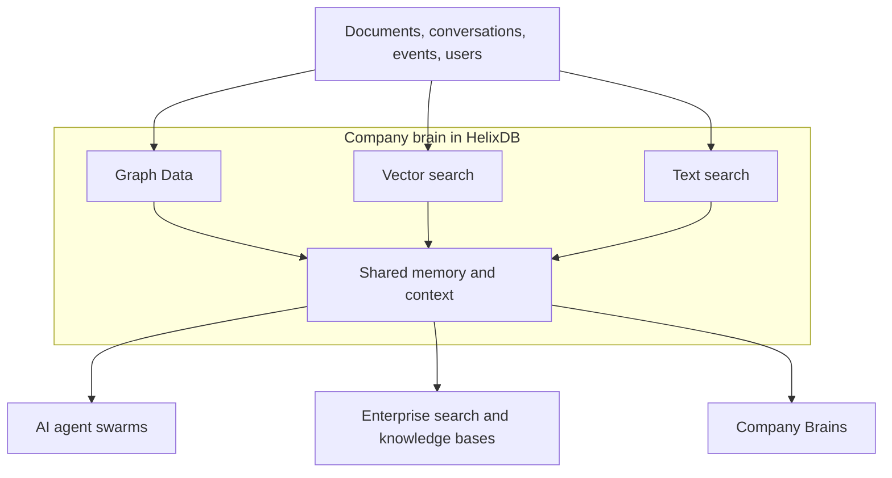

<Badge color="purple" size="sm">Concept</Badge>

HelixDB is a graph database with native vector and full-text search, built on object
storage. It stores and searches knowledge and context for applications where both
explicit structure and meaning matter.

Because graph, vector, and text retrieval live in one database, an application can
work with connected entities, semantically similar content, and exact terms without
synchronizing separate stores. Teams use HelixDB to build enterprise company brains,
large-scale people search, and AI agent swarms.

## How it works

Everything in HelixDB is one labeled property graph. Nodes are your entities, directed
edges are the relationships between them, and both carry typed properties.

Search is not a second system bolted on top. A vector, text, or secondary index is an
access path over a property that already lives on a node or edge: the embedding on a
chunk, the body text of a document, or the `status` field you filter by. That has
three consequences:

- **The graph stays the source of truth.** A semantic match and the relationships
  around it are the same data, read in the same transaction.
- **Nothing needs synchronizing.** There is no separate graph store, vector store, or
  search cluster to keep consistent.
- **Edges are searchable too.** An index is scoped to a label and a property rather
  than a special node type, so you can search and filter relationships as well as
  entities.

## What you get

- **ACID transactions** across graph, vector, and text data.
- **Vector search** with prefiltering and over 90% recall.
- **Full-text search** for exact terms and keyword relevance.
- **Equality and range filtering** on property values.
- **Search and filtering on nodes and edges**, not just nodes.
- **Object storage as the source of truth**, so storage scales independently of compute.
- **Horizontal scaling** across multi-tenant and single-tenant deployments, with BYOC
  coming soon.

## Why object storage

Most graph databases keep all data on one machine's disk, and in the worst case
entirely in memory. That caps how much data you can store and makes large graphs
expensive.

HelixDB keeps object storage as the source of truth and uses NVMe and memory only as
caches. Storage scales separately from compute, so a dataset can grow far beyond the
capacity of the machines that serve it while latency and cost stay low.

## Next steps

<Columns cols={3}>
  <Card title="Get started" icon="rocket" href="/database/helix-db/start-here/quickstart" cta="Start building">
    Start a local instance and run the generated query.
  </Card>
  <Card title="Understand the data model" icon="diagram-project" href="/database/helix-db/core-concepts/data-model" cta="Explore the model">
    Learn how nodes, edges, properties, and indexes represent your data.
  </Card>
  <Card title="Plan a Cloud workload" icon="cloud" href="mailto:founders@helix-db.com" cta="Contact the founders">
    Discuss large-scale Helix Cloud workloads with the founding team.
  </Card>
</Columns>
