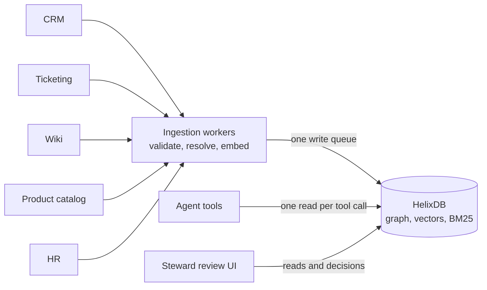
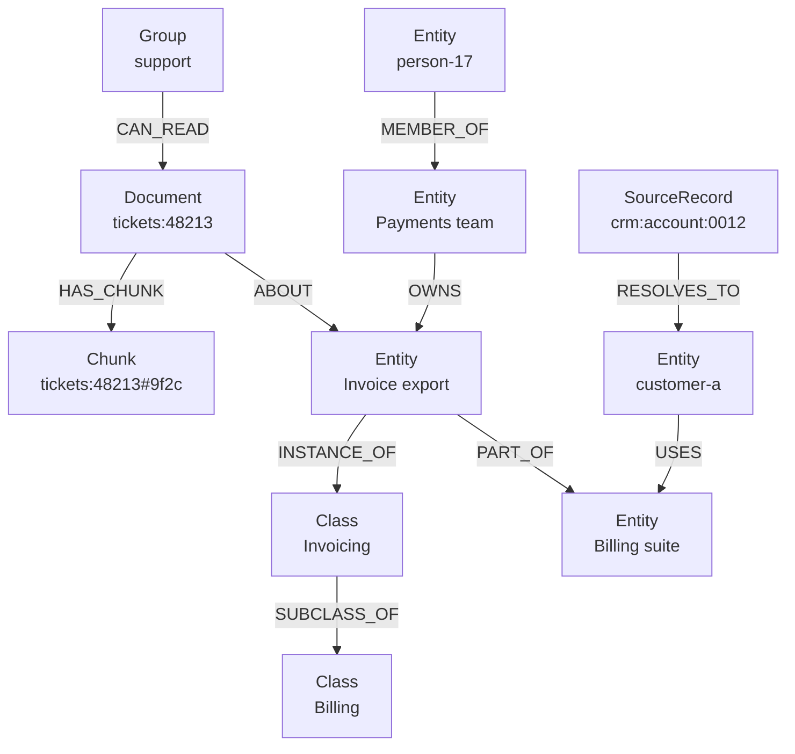

<div className="flex flex-wrap gap-2"><Badge color="blue" size="sm">Guide</Badge></div>

This guide shows how to build a
[knowledge graph](/learn/graph-databases/what-is-a-knowledge-graph) that joins a
company's CRM, ticketing, wiki, product catalog, and HR data into one set of canonical
entities organized by an ontology. It is for engineers who need that graph to stay
correct as sources change, and to ground AI agents without leaking restricted documents.
The result is one graph that answers taxonomy and multi-hop questions in one request each
and gives a support copilot cited, permission-filtered context.

<div className="learn-objectives">
  <Card title="What you will build" icon="diagram-project">
    By the end of this guide you will have:

    - Modeled an ontology as graph data, with a registry that validates every write
    - Resolved records from five systems to one canonical entity each
    - Kept each fact's history and source, with retraction when a source changes
    - Served taxonomy rollups, impact analysis, and agent context in one request each
  </Card>
</div>

## The scenario

Consider a B2B software company with about 3,000 employees that runs five systems of
record:

| System | Contributes | Example key |
| --- | --- | --- |
| CRM | Accounts, ARR, and tier | `crm:account:0012` |
| Ticketing | Tickets, and the account and feature each one is about | `tickets:48213` |
| Wiki | Runbooks, design docs, and postmortems | `wiki:page:3107` |
| Product catalog | Products, features, and the owning team | `catalog:feature:77` |
| HR | People, teams, and team leads | `hr:person:5521` |

The same customer is `Customer A Holdings Inc.` in the CRM, `CUST-A` in tickets, and
`custa-prod` in engineering notes. The feature `Invoice export` has a catalog name, a
ticket component name, and an internal codename. Nothing joins these today, so three
teams have questions nobody can answer:

1. **Data stewards:** is the `Customer A Holdings` in this ticket the customer
   `crm:account:0012`, or a new one?
2. **Product operations:** how many open tickets are there against Billing, including
   every subclass added later?
3. **Support:** which enterprise customers are affected by the invoice export timeout,
   who owns the fix, and what did we tell them? A copilot must answer with citations and
   never quote a document the asker cannot open.

Plan for about 600,000 entities, 1.2 million documents, 6 million chunks, and 150
ontology classes at most six levels deep.

## Requirements

Each requirement below forces one design choice.

| Requirement | Why it matters | Design consequence |
| --- | --- | --- |
| One entity per real-world thing | A customer split in two splits its tickets and ARR, so every count is wrong | A crosswalk of source records makes replays idempotent; exact keys, alias BM25, and embeddings rank candidates in one read |
| New classes need no code change | Classes change every quarter, and a question about Billing must include subclasses added later | `Class` nodes and `SUBCLASS_OF` edges live in the graph and queries traverse them; a new class is a write, not a migration |
| Facts keep history and source | Audits ask who owned a feature on a date, and an edited ticket must withdraw what was extracted from it | Facts are edges with `validFrom`, `validTo`, and `sourceKey`; a change closes the old edge instead of overwriting it |
| A merge is all or nothing | A merge that moves edges but leaves the duplicate searchable returns a ghost entity | One write batch moves the edges, rewrites the survivor's alias text and embedding, and marks the duplicate merged |
| Agents never see text the caller cannot read | Ranking first and filtering after underfills the context, and one forgotten filter leaks restricted text into a prompt | Vector and BM25 search rank only chunks of documents the caller's groups can read |
| Each tool call sees one consistent state | Facts and evidence read at different moments can contradict each other | Multi-hop facts, the permitted chunk pool, and both rankings come back from one read batch |
| Fresh within minutes | Stewards must see their own decisions, and support must see today's tickets | Each source change is one small write, ordered by source revision; reads that must see the last write go to the writer |

Three common designs meet part of this list:

- **A relational database with join tables.** Strong at structured sync, constraints,
  and reporting, with built-in full-text search and vector extensions. The costs here are
  a recursive query for each taxonomy walk, a join chain for each multi-hop question, and
  tuning so a selective permission filter does not underfill vector results. Teams that
  need BM25-quality ranking often add a search engine that shares no transaction with the
  tables.
- **A graph store, a vector store, and a search engine synced by jobs.** Each part
  specializes. A merge or retraction becomes an update across three systems with no
  shared transaction, access lists are copied into each and can drift, and one agent
  question reads three snapshots.
- **A triple store with OWL reasoning.** The right tool for standards-based inference and
  linked data, and named graphs handle per-source provenance well. Per-fact validity
  intervals need reification or RDF-star (see
  [property graph vs RDF](/learn/graph-databases/property-graph-vs-rdf)), and vector
  retrieval usually needs a separate system.

This guide keeps the graph, vectors, and BM25 in
[one database](/learn/database-architecture/one-database-for-graph-vector-and-text), so
a merge or retraction is one transaction and an agent's context is one read of one
snapshot.

## Architecture

The application owns everything that needs a model or a policy decision. HelixDB owns
the data those decisions produce and every query over it.



| Your application owns | HelixDB owns |
| --- | --- |
| Connectors and change capture for each source | The canonical graph: classes, entities, records, documents, chunks, and groups |
| The versioned ontology registry that validates every write | `Class` nodes and `SUBCLASS_OF` edges that queries traverse |
| Chunking, embeddings, and LLM extraction of mentions and facts | Vector indexes over entity profiles and chunks |
| Resolver scoring, match thresholds, and the steward workflow | Unique keys, and BM25 over aliases and chunk text |
| Rank fusion, context packing, and the agent tools | Prefiltered search, multi-hop traversal, and one transaction per request |
| The caller's identity and group membership | `CAN_READ` edges that tool queries filter on before ranking |

## Data model

The ontology lives in two places, generated from one versioned file. The application
registry validates every write: which classes exist, which relationships each class may
have (domain and range) and how many (one current owner per feature), which properties
are required, and the maximum class depth. HelixDB stores a
[property graph](/learn/graph-databases/what-is-a-property-graph) without a fixed schema,
so it would accept `Feature REPORTS_TO Product`; the registry is what rejects it. The
same file seeds `Class` nodes and `SUBCLASS_OF` edges, so queries can walk the taxonomy.

```json
{
  "version": "2026-09-01",
  "maxDepth": 6,
  "classes": {
    "feature.billing": { "parent": "feature" },
    "feature.billing.invoicing": { "parent": "feature.billing" }
  },
  "relations": {
    "OWNS": { "domain": "team", "range": "feature", "perTarget": "one" },
    "MEMBER_OF": { "domain": "person", "range": "team", "required": ["role"] }
  }
}
```

In the graph, one feature and its neighborhood look like this:



| Label | Key properties | Indexes |
| --- | --- | --- |
| `Class` | `classKey`, `name` | Unique `classKey` |
| `Entity` | `entityId`, `entityType`, `status`, `name`, `aliasText` (every name, newline-joined), `profileEmbedding`, and class-specific properties such as `tier` and `arr` on accounts | Unique `entityId`, equality `entityType`, BM25 `aliasText`, vector `profileEmbedding` |
| `SourceRecord` | `recordKey`, linked to its entity by `RESOLVES_TO` | Unique `recordKey` |
| `Document` | `documentKey`, `sourceType`, `status`, `severity`, `revision` | Unique `documentKey` |
| `Chunk` | `chunkId` (document key plus content hash), `documentKey`, `text`, `embedding` | Unique `chunkId`, BM25 `text`, vector `embedding` |
| `Group` | `groupId` | Unique `groupId` |
| Fact edges: `OWNS`, `MEMBER_OF` (with `role`), `PART_OF`, `USES` | `validFrom`, `validTo`, `sourceKey`, `factKey`, `confidence` | Equality `sourceKey` on each label |
| `CAN_READ` edge | `groupId`, copied from the group so a query checks grants from the document side | None; checked during traversal |

- **One `Entity` label, with the class as data.** A node has
  [exactly one label](/database/helix-db/core-concepts/data-model) and indexes are scoped
  by label, so one label keeps one alias index and one profile vector index for
  resolving across every class. `entityType` holds the most specific class key and
  `INSTANCE_OF` points to the same class, so a reclassification changes both in one
  write batch.
- **Facts are edges with a source.** `sourceKey` is the record or document that stated
  the fact, `factKey` names the statement (`USES customer-c prod-billing-suite`) so a
  sync can diff facts the way it diffs chunks, and a current fact has no `validTo`.
  Timestamps are epoch milliseconds so writes, filters, and range indexes use one type.

Create the client once per process with `Client.server(url).withApiKey(apiKey)`
(Python: `Client.server(url).with_api_key(api_key)`) and pass it to each function in this
guide. Create the indexes before loading data.

{/* sdk-examples: TypeScript, Python */}
<CodeGroup>

```ts TypeScript
import {
  Client, IndexSpec, VectorDistanceMetric, g, writeBatch,
} from "@helix-db/helix-db";

const DIMENSION = 1536; // fixed by your embedding model
const COSINE = VectorDistanceMetric.Cosine;
const FACT_LABELS = ["OWNS", "MEMBER_OF", "PART_OF", "USES"];

const INDEXES = [
  IndexSpec.nodeUniqueEquality("Class", "classKey"),
  IndexSpec.nodeUniqueEquality("Entity", "entityId"),
  IndexSpec.nodeEquality("Entity", "entityType"),
  IndexSpec.nodeText("Entity", "aliasText"),
  IndexSpec.nodeVector("Entity", "profileEmbedding", DIMENSION, COSINE),
  IndexSpec.nodeUniqueEquality("SourceRecord", "recordKey"),
  IndexSpec.nodeUniqueEquality("Document", "documentKey"),
  IndexSpec.nodeUniqueEquality("Chunk", "chunkId"),
  IndexSpec.nodeText("Chunk", "text"),
  IndexSpec.nodeVector("Chunk", "embedding", DIMENSION, COSINE),
  IndexSpec.nodeUniqueEquality("Group", "groupId"),
  ...FACT_LABELS.map((label) => IndexSpec.edgeEquality(label, "sourceKey")),
];

export async function createIndexes(client: Client) {
  const names = INDEXES.map((_, i) => `index${i}`);
  const request = INDEXES.reduce(
    (batch, spec, i) => batch.varAs(names[i], g().createIndexIfNotExists(spec)),
    writeBatch(),
  ).returning(names).toQueryRequest({ queryName: "create_indexes" });
  return client.query<Record<string, unknown>>(request).send();
}
```

```python Python
from helixdb import Client, IndexSpec, VectorDistanceMetric, g, write_batch

DIMENSION = 1536  # fixed by your embedding model
COSINE = VectorDistanceMetric.COSINE
FACT_LABELS = ["OWNS", "MEMBER_OF", "PART_OF", "USES"]

INDEXES = [
    IndexSpec.node_unique_equality("Class", "classKey"),
    IndexSpec.node_unique_equality("Entity", "entityId"),
    IndexSpec.node_equality("Entity", "entityType"),
    IndexSpec.node_text("Entity", "aliasText"),
    IndexSpec.node_vector("Entity", "profileEmbedding", DIMENSION, COSINE),
    IndexSpec.node_unique_equality("SourceRecord", "recordKey"),
    IndexSpec.node_unique_equality("Document", "documentKey"),
    IndexSpec.node_unique_equality("Chunk", "chunkId"),
    IndexSpec.node_text("Chunk", "text"),
    IndexSpec.node_vector("Chunk", "embedding", DIMENSION, COSINE),
    IndexSpec.node_unique_equality("Group", "groupId"),
    *(IndexSpec.edge_equality(label, "sourceKey") for label in FACT_LABELS),
]


def create_indexes(client: Client) -> dict:
    names = [f"index{i}" for i in range(len(INDEXES))]
    batch = write_batch()
    for name, spec in zip(names, INDEXES):
        batch = batch.var_as(name, g().create_index_if_not_exists(spec))
    request = batch.returning(names).to_query_request(query_name="create_indexes")
    return client.query(request)
```

</CodeGroup>

Index creation is asynchronous. Each entry returns a receipt; poll its operation until it
reports `succeeded` before you load data. See
[secondary indexes](/database/helix-db/query-guides/secondary-indexes).

## Load and update data

Each source change becomes one small write batch that is safe to replay and ordered by
the source's revision, so a connector can retry after a failure and a late delivery
never undoes a newer change. Load classes from the registry first, then entities,
documents, and facts. An edge write fails when its target is missing but adds nothing
when its source is missing, so return both lookups and treat an empty one as a
validation failure. Lookup-then-create mechanics and batch sizing are in
[production patterns](/learn/guides/production-patterns).

### Upsert entities

After the resolver picks an `entityId` (next section), one write batch looks the entity
up by that key, creates it with an `INSTANCE_OF` edge when the lookup is empty, sets
`name`, `aliasText`, and `profileEmbedding`, and links the source record through
`RESOLVES_TO`. The text and vector change in the same transaction as the graph, so
search never finds a name the graph does not have. Look the ID up without a status
filter, and when it names a merged tombstone, write to the entity its `MERGED_INTO` edge
points to. Derive aliases only from structured sources or documents everyone can read.

### Supersede facts

A change never overwrites a fact. To move `Invoice export` to a new team, one write batch
sets `validTo` on the current `OWNS` edge and adds a new edge whose `validFrom` is that
same time. The time is the change's effective time from the source, passed as an i64
param, so "who owned it on a date" follows the business change rather than the load.
Guard the batch with a lookup for a current edge that is older than the change
(`Predicate.ltParam` on `validFrom`), so a replayed or late change does nothing, and send
a change only when the team or role actually differs.

### Sync a changed document

A document sync runs once per source revision. The application splits the new version
into chunks whose `chunkId` is the document key plus a content hash, so an edited
paragraph becomes one removed ID and one new ID. It extracts the facts the version
states and reads the access list from the source. One write batch then brings the
document, its grants, its chunks, and its facts up to that revision.

{/* sdk-examples: TypeScript, Python */}
<CodeGroup>

```ts TypeScript
import {
  BatchCondition, Client, NodeRef, Predicate, PropertyInput, SourcePredicate,
  defineParams, g, param, writeBatch, type ParamInputs,
} from "@helix-db/helix-db";

const FACT_LABELS = ["OWNS", "MEMBER_OF", "PART_OF", "USES"];
const shape = {
  document_key: param.string(),
  revision: param.i64(), // the source's updatedAt in epoch milliseconds
  source_type: param.string(),
  status: param.string(),
  severity: param.string(),
  groups: param.array(param.object()), // the source's access list: { group_id }
  chunk_ids: param.array(param.string()), // every chunk in this revision
  new_chunks: param.array(param.object()), // { chunk_id, text, embedding }
  fact_keys: param.array(param.string()), // every fact this revision states
};
const params = defineParams(shape);
const key = SourcePredicate.eq("documentKey", params.document_key);
const stated = SourcePredicate.eq("sourceKey", params.document_key);
const doc = NodeRef.var("doc");
const applies = BatchCondition.varNotEmpty("doc");

// 1. Create the document on first sight. Continue only when this revision is not older
//    than the stored one, so a late delivery writes nothing.
const upsert = writeBatch()
  .varAs("found", g().nWithLabelWhere("Document", key))
  .varAsIf("created", BatchCondition.varEmpty("found"), g().addN("Document", {
    documentKey: params.document_key,
    sourceType: params.source_type,
  }))
  .varAs("doc", g().nWithLabelWhere("Document", key)
    .where(Predicate.or([
      Predicate.isNull("revision"),
      Predicate.lteParam("revision", "revision"),
    ]))
    .setProperty("revision", params.revision)
    .setProperty("status", params.status)
    .setProperty("severity", params.severity));

// 2. Close the facts this revision no longer states; unchanged facts stay open.
const retract = FACT_LABELS.reduce(
  (batch, label) => batch.varAsIf(label, applies, g()
    .eWithLabelWhere(label, stated)
    .where(Predicate.isNull("validTo"))
    .where(Predicate.not(Predicate.isInParam("factKey", "fact_keys")))
    .setProperty("validTo", params.revision)),
  upsert,
);

const query = retract
  // 3. Replace the grants with the source's access list.
  .varAs("revoked", g().n(doc).inE("CAN_READ").drop())
  .forEachParam("groups", writeBatch()
    .varAs("group", g()
      .nWithLabelWhere("Group", Predicate.eqParam("groupId", "group_id")))
    .varAsIf("granted", applies, g().n(NodeRef.var("group"))
      .addE("CAN_READ", doc, { groupId: PropertyInput.param("group_id") })))
  // 4. Drop chunks that left the document, then add new chunks that are not stored.
  .varAs("dropped", g().n(doc).out("HAS_CHUNK")
    .where(Predicate.not(Predicate.isInParam("chunkId", "chunk_ids")))
    .drop())
  .forEachParam("new_chunks", writeBatch()
    .varAs("stored", g()
      .nWithLabelWhere("Chunk", Predicate.eqParam("chunkId", "chunk_id")))
    .varAsIf("parent", BatchCondition.varEmpty("stored"), g().n(doc))
    .varAsIf("chunk", BatchCondition.varNotEmpty("parent"), g().addN("Chunk", {
      chunkId: PropertyInput.param("chunk_id"),
      documentKey: params.document_key,
      text: PropertyInput.param("text"),
      embedding: PropertyInput.param("embedding"),
    }))
    .varAsIf("linked", BatchCondition.varNotEmpty("chunk"),
      g().n(NodeRef.var("parent")).addE("HAS_CHUNK", NodeRef.var("chunk"))))
  .returning(["doc", ...FACT_LABELS]);

export async function syncDocument(client: Client, args: ParamInputs<typeof shape>) {
  const request = query.toQueryRequest(params, args, { queryName: "sync_document" });
  return client.query(request).send();
}
```

```python Python
from helixdb import (
    BatchCondition, Client, NodeRef, Predicate, PropertyInput, SourcePredicate,
    define_params, g, param, write_batch,
)

FACT_LABELS = ["OWNS", "MEMBER_OF", "PART_OF", "USES"]
params = define_params({
    "document_key": param.string(),
    "revision": param.i64(),  # the source's updatedAt in epoch milliseconds
    "source_type": param.string(),
    "status": param.string(),
    "severity": param.string(),
    "groups": param.array(param.object()),  # the source's access list: {group_id}
    "chunk_ids": param.array(param.string()),  # every chunk in this revision
    "new_chunks": param.array(param.object()),  # {chunk_id, text, embedding}
    "fact_keys": param.array(param.string()),  # every fact this revision states
})
key = SourcePredicate.eq("documentKey", params.document_key)
stated = SourcePredicate.eq("sourceKey", params.document_key)
doc = NodeRef.var("doc")
applies = BatchCondition.var_not_empty("doc")

# 1. Create the document on first sight. Continue only when this revision is not older
#    than the stored one, so a late delivery writes nothing.
upsert = (
    write_batch()
    .var_as("found", g().n_with_label_where("Document", key))
    .var_as_if("created", BatchCondition.var_empty("found"), g().add_n("Document", {
        "documentKey": params.document_key,
        "sourceType": params.source_type,
    }))
    .var_as("doc", g().n_with_label_where("Document", key)
        .where(Predicate.or_([
            Predicate.is_null("revision"),
            Predicate.lte_param("revision", "revision"),
        ]))
        .set_property("revision", params.revision)
        .set_property("status", params.status)
        .set_property("severity", params.severity))
)

# 2. Close the facts this revision no longer states; unchanged facts stay open.
retract = upsert
for label in FACT_LABELS:
    retract = retract.var_as_if(label, applies, g()
        .e_with_label_where(label, stated)
        .where(Predicate.is_null("validTo"))
        .where(Predicate.not_(Predicate.is_in_param("factKey", "fact_keys")))
        .set_property("validTo", params.revision))

query = (
    retract
    # 3. Replace the grants with the source's access list.
    .var_as("revoked", g().n(doc).in_e("CAN_READ").drop())
    .for_each_param("groups", write_batch()
        .var_as("group", g()
            .n_with_label_where("Group", Predicate.eq_param("groupId", "group_id")))
        .var_as_if("granted", applies, g().n(NodeRef.var("group"))
            .add_e("CAN_READ", doc, {"groupId": PropertyInput.param("group_id")})))
    # 4. Drop chunks that left the document, then add new chunks that are not stored.
    .var_as("dropped", g().n(doc).out("HAS_CHUNK")
        .where(Predicate.not_(Predicate.is_in_param("chunkId", "chunk_ids")))
        .drop())
    .for_each_param("new_chunks", write_batch()
        .var_as("stored", g()
            .n_with_label_where("Chunk", Predicate.eq_param("chunkId", "chunk_id")))
        .var_as_if("parent", BatchCondition.var_empty("stored"), g().n(doc))
        .var_as_if("chunk", BatchCondition.var_not_empty("parent"), g().add_n("Chunk", {
            "chunkId": PropertyInput.param("chunk_id"),
            "documentKey": params.document_key,
            "text": PropertyInput.param("text"),
            "embedding": PropertyInput.param("embedding"),
        }))
        .var_as_if("linked", BatchCondition.var_not_empty("chunk"),
            g().n(NodeRef.var("parent")).add_e("HAS_CHUNK", NodeRef.var("chunk"))))
    .returning(["doc", *FACT_LABELS])
)


def sync_document(client: Client, args: dict) -> dict:
    request = query.to_query_request(params, args, query_name="sync_document")
    return client.query(request)
```

</CodeGroup>

The revision check makes the batch safe to repeat: a late delivery of an older revision
writes nothing and returns an empty `doc`, and a replay of the same revision rewrites
the same state. To split a revision that is too large for one request, send it several
times with the full `chunk_ids` and `fact_keys` and a slice of `new_chunks` each. Write
the facts a revision adds right after its sync, keyed by `factKey` so a replay finds
them, and gated on the document still being at that revision. Promote facts only from
documents everyone can read, because facts are not permission-filtered.

Grant changes take effect when the sync commits, so put access-list changes at the front
of the connector's queue. When a source deletes a document, sync a final revision with
status `deleted` and empty lists. That revokes every grant, drops every chunk, and closes
every fact, and the node stays as a tombstone so a late replay cannot restore it.

### Merge duplicates

When a steward confirms a proposed `SAME_AS` pair, one write batch:

1. Copies every edge on the duplicate to the survivor with a `mergedFrom` property and
   drops the originals, since edges cannot be re-pointed. Edges without properties, such
   as `ABOUT` and `RESOLVES_TO`, move by label inside the transaction; fact edges arrive
   as rows that carry their properties.
2. Rebuilds the survivor's `aliasText` and embedding from both entities.
3. Sets the duplicate's `status` to `merged`, drops its `INSTANCE_OF` edge, and adds
   `MERGED_INTO`. The tombstone keeps its own alias text and embedding, and its status
   keeps it out of every resolution pool.

Test the merge on your largest entity. If it runs past the per-request time budget,
mark the duplicate `merging` first, move its edges in several batches, and tombstone it
in the last one.

## Resolve a mention to one entity

A ticket names `Customer A Holdings` under an org ID the crosswalk has never seen. Is it
customer-a? One read returns three candidate lists from the same snapshot: any crosswalk
hit for the record, [BM25](/learn/full-text-search/what-is-bm25) matches over alias text,
and the nearest profile [embeddings](/learn/vector-search/what-are-vector-embeddings).
Both searches rank only active entities of a compatible class, so a team named
"Customer Success" is never a candidate for an account.

{/* sdk-examples: TypeScript, Python */}
<CodeGroup>

```ts TypeScript
import {
  Client, NodeRef, Predicate, SourcePredicate, defineParams, g, param, readBatch,
  type ParamInputs,
} from "@helix-db/helix-db";

const shape = {
  record_key: param.string(), // the source record that carries the mention
  mention: param.string(), // "Customer A Holdings"
  embedding: param.array(param.f32()), // the mention, embedded by the application
  candidate_types: param.array(param.string()), // the class and its subclasses
  k: param.i64(),
};
const params = defineParams(shape);
const record = SourcePredicate.eq("recordKey", params.record_key);
const compatible = SourcePredicate.isInParam("entityType", "candidate_types");
const pool = NodeRef.var("pool");
const fields = ["entityId", "name", "entityType"];

const query = readBatch()
  .varAs("known", g()
    .nWithLabelWhere("SourceRecord", record)
    .out("RESOLVES_TO")
    .valueMap(fields))
  .varAs("pool", g()
    .nWithLabelWhere("Entity", compatible)
    .where(Predicate.eq("status", "active")))
  .varAs("byAlias", g().n(pool)
    .textSearchWith("Entity", "aliasText", params.mention, params.k)
    .valueMap([...fields, "$score"]))
  .varAs("byMeaning", g().n(pool)
    .vectorSearchWith("Entity", "profileEmbedding", params.embedding, params.k)
    .valueMap([...fields, "$distance"]))
  .returning(["known", "byAlias", "byMeaning"]);

type Candidate = {
  entityId: string; name: string; entityType: string;
  $score?: number; $distance?: number;
};

export async function resolveMention(client: Client, args: ParamInputs<typeof shape>) {
  const request = query.toQueryRequest(params, args, { queryName: "resolve_mention" });
  return client.query<Record<string, Candidate[]>>(request).send();
}
```

```python Python
from helixdb import (
    Client, NodeRef, Predicate, SourcePredicate, define_params, g, param, read_batch,
)

params = define_params({
    "record_key": param.string(),  # the source record that carries the mention
    "mention": param.string(),  # "Customer A Holdings"
    "embedding": param.array(param.f32()),  # the mention, embedded by the application
    "candidate_types": param.array(param.string()),  # the class and its subclasses
    "k": param.i64(),
})
record = SourcePredicate.eq("recordKey", params.record_key)
compatible = SourcePredicate.is_in_param("entityType", "candidate_types")
pool = NodeRef.var("pool")
fields = ["entityId", "name", "entityType"]

query = (
    read_batch()
    .var_as("known", g()
        .n_with_label_where("SourceRecord", record)
        .out("RESOLVES_TO")
        .value_map(fields))
    .var_as("pool", g()
        .n_with_label_where("Entity", compatible)
        .where(Predicate.eq("status", "active")))
    .var_as("byAlias", g().n(pool)
        .text_search_with("Entity", "aliasText", params.mention, params.k)
        .value_map([*fields, "$score"]))
    .var_as("byMeaning", g().n(pool)
        .vector_search_with("Entity", "profileEmbedding", params.embedding, params.k)
        .value_map([*fields, "$distance"]))
    .returning(["known", "byAlias", "byMeaning"])
)


def resolve_mention(client: Client, args: dict) -> dict:
    request = query.to_query_request(params, args, query_name="resolve_mention")
    return client.query(request)
```

</CodeGroup>

The application fuses `byAlias` and `byMeaning` with reciprocal rank fusion and applies
thresholds tuned on labeled match pairs: link automatically above a high score, propose a
`SAME_AS` edge for stewards in the middle band, and create a new entity below it.
`candidate_types` comes from the registry's cached subclass closure. Both searches rank
every active entity of those classes exactly, so cost grows with the size of the class
rather than with `k`. See [hybrid search](/learn/full-text-search/hybrid-search) for
fusion and [prefiltered search](/database/helix-db/query-guides/prefiltering) for pool
rules.

## Roll up tickets through the taxonomy

Product operations asks how many open tickets there are against Billing features,
including Invoicing, Payments, and any subclass added next quarter. The query walks down
`SUBCLASS_OF` from the class, collects the features that are instances of any class it
reached, and counts their open tickets by severity.

{/* sdk-examples: TypeScript, Python */}
<CodeGroup>

```ts TypeScript
import {
  Client, NodeRef, Predicate, RepeatConfig, SourcePredicate,
  defineParams, g, param, readBatch, sub, type ParamInputs,
} from "@helix-db/helix-db";

const MAX_DEPTH = 6; // the registry's maxDepth
const shape = { class_key: param.string() };
const params = defineParams(shape);
const openTicket = Predicate.and([
  Predicate.eq("sourceType", "ticket"),
  Predicate.eq("status", "open"),
]);

const query = readBatch()
  .varAs("classes", g()
    .nWithLabelWhere("Class", SourcePredicate.eq("classKey", params.class_key))
    .repeat(RepeatConfig.new(sub().in("SUBCLASS_OF")).times(MAX_DEPTH).emitAll())
    .dedup())
  .varAs("features", g().n(NodeRef.var("classes")).in("INSTANCE_OF").dedup())
  .varAs("bySeverity", g().n(NodeRef.var("features"))
    .in("ABOUT")
    .where(openTicket)
    .dedup()
    .groupCount("severity"))
  .returning(["bySeverity"]);

type Rollup = { bySeverity: { severity: string; count: number }[] };

export async function openTicketsByClass(
  client: Client, args: ParamInputs<typeof shape>,
) {
  const request = query.toQueryRequest(params, args, {
    queryName: "open_tickets_by_class",
  });
  return client.query<Rollup>(request).send();
}
```

```python Python
from helixdb import (
    Client, NodeRef, Predicate, RepeatConfig, SourcePredicate,
    define_params, g, param, read_batch, sub,
)

MAX_DEPTH = 6  # the registry's maxDepth
params = define_params({"class_key": param.string()})
open_ticket = Predicate.and_([
    Predicate.eq("sourceType", "ticket"),
    Predicate.eq("status", "open"),
])

query = (
    read_batch()
    .var_as("classes", g()
        .n_with_label_where("Class", SourcePredicate.eq("classKey", params.class_key))
        .repeat(RepeatConfig.new(sub().in_("SUBCLASS_OF")).times(MAX_DEPTH).emit_all())
        .dedup())
    .var_as("features", g().n(NodeRef.var("classes")).in_("INSTANCE_OF").dedup())
    .var_as("bySeverity", g().n(NodeRef.var("features"))
        .in_("ABOUT")
        .where(open_ticket)
        .dedup()
        .group_count("severity"))
    .returning(["bySeverity"])
)


def open_tickets_by_class(client: Client, args: dict) -> dict:
    request = query.to_query_request(params, args, query_name="open_tickets_by_class")
    return client.query(request)
```

</CodeGroup>

`emitAll` returns the starting class and every level below it, and `times` bounds the
walk at `maxDepth`, which the registry enforces by rejecting deeper classes. Both `dedup`
steps matter: the taxonomy can reach a class by two paths, and one ticket can be about
two features. `groupCount` groups on one property and ends the traversal; add another
entry when you need per-feature rows. When the ontology gains `feature.billing.tax`, this
query covers it with no code change.

The walk reads every document ever filed about those features before it keeps the open
tickets, so cost grows with history; run it per area, not for the root class. The counts
are not permission-filtered.

## Find who is affected and who owns the fix

Support asks which enterprise customers are affected by the invoice export timeout, who
owns the fix, and what the company has told them. Once the question resolves to the
feature `Invoice export`, one read batch answers all three: the current owner and its
lead, the active enterprise customers on a product that contains the feature, and what
the documents the caller can read say about it.

{/* sdk-examples: TypeScript, Python */}
<CodeGroup>

```ts TypeScript
import {
  BindingProjection, Client, NodeRef, Order, Predicate, SourcePredicate,
  defineParams, g, param, readBatch, type ParamInputs,
} from "@helix-db/helix-db";

const shape = {
  feature_id: param.string(),
  question: param.string(),
  embedding: param.array(param.f32()), // the question, embedded by the application
  groups: param.array(param.string()), // from the verified caller identity
  max_accounts: param.i64(),
  k: param.i64(),
};
const params = defineParams(shape);
const current = Predicate.isNull("validTo");
const currentLead = Predicate.and([current, Predicate.eq("role", "lead")]);
const [feature, pool] = [NodeRef.var("feature"), NodeRef.var("pool")];
const chunkFields = ["chunkId", "documentKey", "text"];

const query = readBatch()
  .varAs("feature", g()
    .nWithLabelWhere("Entity", SourcePredicate.eq("entityId", params.feature_id)))
  // The current owner and the source of that fact.
  .varAs("owner", g().n(feature)
    .inE("OWNS").where(current).bind("owns")
    .inN().bind("team")
    .projectDistinctBindings([
      BindingProjection.binding("team", "name", "team"),
      BindingProjection.binding("owns", "sourceKey", "source"),
    ]))
  // Its current lead, in a separate entry so a team between leads still comes back.
  .varAs("lead", g().n(feature)
    .inE("OWNS").where(current).inN()
    .inE("MEMBER_OF").where(currentLead).inN()
    .valueMap(["name"]))
  // Active enterprise customers on a product that contains the feature, by ARR.
  .varAs("accounts", g().n(feature)
    .outE("PART_OF").where(current).outN()
    .inE("USES").where(current).inN()
    .where(Predicate.eq("status", "active"))
    .where(Predicate.eq("tier", "enterprise"))
    .dedup()
    .orderBy("arr", Order.Desc)
    .limit(params.max_accounts)
    .valueMap(["name", "arr"]))
  // Chunks of documents about the feature with a grant for one of the caller's
  // groups. From a grant edge, outN() is the document it points to.
  .varAs("pool", g().n(feature)
    .in("ABOUT")
    .inE("CAN_READ").where(Predicate.isInParam("groupId", "groups")).outN()
    .dedup()
    .out("HAS_CHUNK"))
  .varAs("semantic", g().n(pool)
    .vectorSearchWith("Chunk", "embedding", params.embedding, params.k)
    .valueMap([...chunkFields, "$distance"]))
  .varAs("keyword", g().n(pool)
    .textSearchWith("Chunk", "text", params.question, params.k)
    .valueMap([...chunkFields, "$score"]))
  .returning(["owner", "lead", "accounts", "semantic", "keyword"]);

type Chunk = { chunkId: string; documentKey: string; text: string };
type Context = {
  owner: { team: string; source: string }[];
  lead: { name: string }[];
  accounts: { name: string; arr: number }[];
  semantic: Chunk[];
  keyword: Chunk[];
};

export async function incidentContext(client: Client, args: ParamInputs<typeof shape>) {
  const request = query.toQueryRequest(params, args, { queryName: "incident_context" });
  return client.query<Context>(request).send();
}
```

```python Python
from helixdb import (
    BindingProjection, Client, NodeRef, Order, Predicate, SourcePredicate,
    define_params, g, param, read_batch,
)

params = define_params({
    "feature_id": param.string(),
    "question": param.string(),
    "embedding": param.array(param.f32()),  # the question, embedded by the application
    "groups": param.array(param.string()),  # from the verified caller identity
    "max_accounts": param.i64(),
    "k": param.i64(),
})
current = Predicate.is_null("validTo")
current_lead = Predicate.and_([current, Predicate.eq("role", "lead")])
feature, pool = NodeRef.var("feature"), NodeRef.var("pool")
chunk_fields = ["chunkId", "documentKey", "text"]

query = (
    read_batch()
    .var_as("feature", g().n_with_label_where(
        "Entity", SourcePredicate.eq("entityId", params.feature_id)))
    # The current owner and the source of that fact.
    .var_as("owner", g().n(feature)
        .in_e("OWNS").where(current).bind("owns")
        .in_n().bind("team")
        .project_distinct_bindings([
            BindingProjection.binding("team", "name", "team"),
            BindingProjection.binding("owns", "sourceKey", "source"),
        ]))
    # Its current lead, in a separate entry so a team between leads still comes back.
    .var_as("lead", g().n(feature)
        .in_e("OWNS").where(current).in_n()
        .in_e("MEMBER_OF").where(current_lead).in_n()
        .value_map(["name"]))
    # Active enterprise customers on a product that contains the feature, by ARR.
    .var_as("accounts", g().n(feature)
        .out_e("PART_OF").where(current).out_n()
        .in_e("USES").where(current).in_n()
        .where(Predicate.eq("status", "active"))
        .where(Predicate.eq("tier", "enterprise"))
        .dedup()
        .order_by("arr", Order.DESC)
        .limit(params.max_accounts)
        .value_map(["name", "arr"]))
    # Chunks of documents about the feature with a grant for one of the caller's
    # groups. From a grant edge, out_n() is the document it points to.
    .var_as("pool", g().n(feature)
        .in_("ABOUT")
        .in_e("CAN_READ").where(Predicate.is_in_param("groupId", "groups")).out_n()
        .dedup()
        .out("HAS_CHUNK"))
    .var_as("semantic", g().n(pool)
        .vector_search_with("Chunk", "embedding", params.embedding, params.k)
        .value_map([*chunk_fields, "$distance"]))
    .var_as("keyword", g().n(pool)
        .text_search_with("Chunk", "text", params.question, params.k)
        .value_map([*chunk_fields, "$score"]))
    .returning(["owner", "lead", "accounts", "semantic", "keyword"])
)


def incident_context(client: Client, args: dict) -> dict:
    request = query.to_query_request(params, args, query_name="incident_context")
    return client.query(request)
```

</CodeGroup>

- **Current facts only.** Every hop filters on a missing `validTo`, so a superseded owner
  or a retracted `USES` fact never appears, and the owner row carries the `sourceKey` to
  cite.
- **Permissions before ranking.** The pool holds only chunks of documents with a grant
  for one of the caller's groups, so a restricted postmortem never enters the top k (see
  [filtered vector search](/learn/vector-search/filtered-vector-search)). The pool starts
  from the feature, not the groups, because an all-employees group can read most
  documents and a prefiltered search rejects pools over 1,000,000 candidates.
- **Fusion and packing.** The application fuses `semantic` and `keyword` with reciprocal
  rank fusion, then gives the model the owner, the lead, the accounts, and the chunks
  with their `documentKey` for citations.

## Connect an agent

Give the agent a few fixed, parameterized tools, never raw query access. Each tool is one
read batch, so everything the model sees for one call comes from one snapshot. The model
supplies only what it can know, and the tool service fills in the rest from the verified
caller and the registry:

| Tool | The model supplies | Your service supplies | Runs |
| --- | --- | --- | --- |
| `resolve_mention` | Mention text and target class | Record key, embedding, and the subclass list | [Resolve a mention](#resolve-a-mention-to-one-entity) |
| `open_tickets_by_class` | A class key, checked against the feature subtree | Nothing | [Roll up tickets](#roll-up-tickets-through-the-taxonomy) |
| `incident_context` | Feature ID and the question | Embedding, the caller's groups, and `k` | [Find who is affected](#find-who-is-affected-and-who-owns-the-fix) |

HelixDB does not enforce document grants; the tool service does, by building every
document read from the caller's verified groups. Give tool services a read-only key and
keep ingestion's read-write key elsewhere. Structured facts such as owners and ARR reach
every caller of a tool, so keep sensitive properties out of tool output or give each
audience its own tool. An agent that proposes a fact sends it through the same validated
write path as a connector. See [What is GraphRAG?](/learn/ai-memory/what-is-graphrag) for
the pattern and [production patterns](/learn/guides/production-patterns) for tool-service
hygiene.

## Limits and when this is not a fit

These limits shape the design above; each has a workaround that keeps it intact.

| Limit | Effect on this design | What to do |
| --- | --- | --- |
| A write may touch at most 512 text-indexed records by default, and a Helix Cloud request body at most 2 MiB | A 1536-dimension embedding is roughly 15 to 30 KB of JSON, so one request carries on the order of 100 new chunks | Size batches by bytes as well as count, and split a large revision across several syncs |
| Concurrent writes to the same text or vector index can conflict, even on different nodes | Parallel ingestion workers get HTTP 409 `transaction_conflict` instead of more throughput | Run one writer queue per database and [retry conflicts](/database/helix-cloud/operate/error-handling) with backoff |
| One [rate-limit](/database/helix-cloud/operate/limits) bucket per database serves reads and writes | Agent, steward, and ingestion traffic share one requests-per-second budget | Budget them together, and throttle bulk loads below the plan rate |
| A prefiltered vector search fails when `min(k, candidates)` exceeds 800, and any prefiltered search fails above 1,000,000 candidates | A pool built from a hub, such as a broad class or an all-employees group, is rejected | Keep `k` at or below 800 and start pools from an entity or a narrow class |
| Membership filters currently use an index for at most 64 values | A class with more than 64 subclasses is filtered by a scan | Also store the top-level class as an indexed property and filter on that |
| Readers can lag the writer | A steward may not see their own decision | Send [read-after-write](/database/helix-cloud/operate/guarantees#readers-and-read-after-write) reads with `writerOnly()` |
| Aggregations group on one property and end the traversal | No `HAVING` or multi-column rollups | Run several aggregation entries, and keep BI in a warehouse |
| RBAC, SSO/SAML, audit logs, and PrivateLink are up next; backups and point-in-time recovery are in progress; BYOC is coming soon | Access control, attribution, and recovery live in your services and pipelines today | Record who decided on each edge, keep ingestion replayable, and keep embeddings outside the database so a rebuild does not re-embed; see the [roadmap](/database/helix-db/start-here/roadmap), [security](/database/helix-cloud/operate/security), and [production patterns](/learn/guides/production-patterns) |

This design is not a fit when:

- You need standards-based semantics: OWL or RDFS reasoning, SHACL validation, SPARQL,
  or linked data under global IRIs. Use an RDF store, optionally fed from this graph.
- The main workload is whole-graph analytics, such as PageRank, community detection, or
  weighted shortest paths. Run those in an analytics engine on an export.
- The questions are BI reports that group by several columns and join tens of millions
  of rows. Keep the warehouse.
- Your policy requires the database itself to enforce per-user document access, such as
  row-level security or per-user credentials.
- The enterprise controls in the last row above, or self-hosting with high availability,
  are day-one requirements. The local server runs as a single node.
- The taxonomy is small and static, and nobody asks multi-hop questions or runs agents.
  A relational table and a search index are simpler.

## Frequently asked questions

### How do I ask who owned a feature on a date?

Filter the fact edge on its validity window instead of a missing `validTo`: `validFrom`
at or before the date, and `validTo` missing or after it (`Predicate.lteParam`,
`Predicate.or`, `Predicate.isNull`, and `Predicate.gtParam`), with the date passed as an
i64 epoch-milliseconds param.

### Can a merge be undone?

Yes. Every moved edge carries `mergedFrom`, and the tombstone keeps its alias text and
embedding, so an unmerge moves those edges back, rebuilds the survivor's alias text and
embedding, and sets the tombstone's status to `active`.

### How long does the first load take?

Measure it on a sample of your data rather than estimating it. Chunk writes run through
one writer queue, each request is bounded by both the 512-record cap and the body size,
and your pipeline computes embeddings before any write. Time one full batch, multiply by
the number of batches, and compare the request count with your plan's
[rate limit](/database/helix-cloud/operate/limits).

## Next steps

<CardGroup cols={2}>
  <Card title="Production patterns" icon="gears" href="/learn/guides/production-patterns">
    Batching, rank fusion, read-after-write, and sizing for every solution guide.
  </Card>
  <Card title="Prefiltered search" icon="filter" href="/database/helix-db/query-guides/prefiltering">
    Rank only the nodes a traversal reaches, with vectors or BM25.
  </Card>
  <Card title="Traversals" icon="route" href="/database/helix-db/query-guides/traversals">
    Walk typed edges, bind hops, and filter on edge properties.
  </Card>
  <Card title="What is GraphRAG?" icon="share-nodes" href="/learn/ai-memory/what-is-graphrag">
    Retrieval that follows relationships, compared with vector RAG.
  </Card>
</CardGroup>
